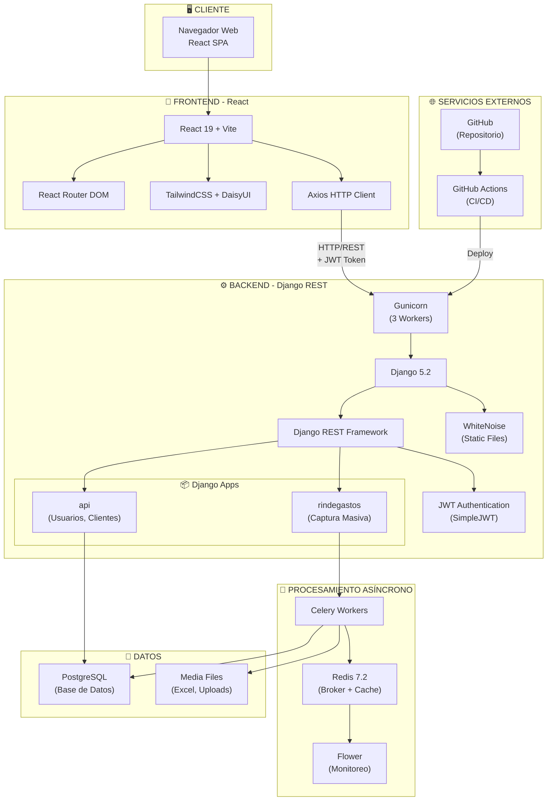
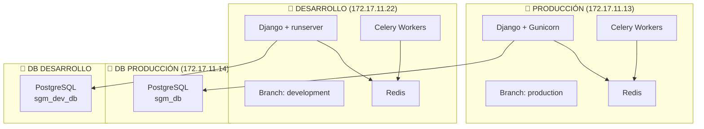
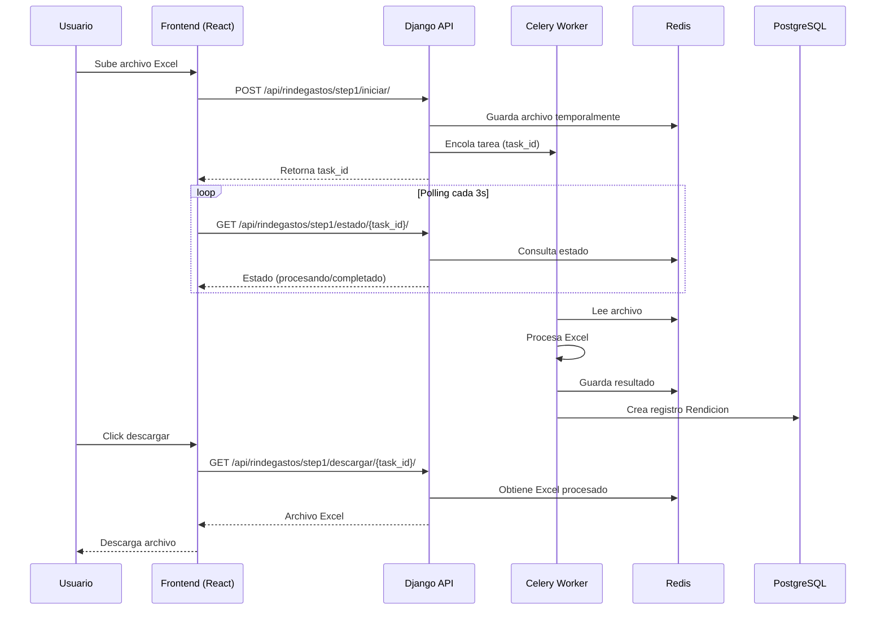
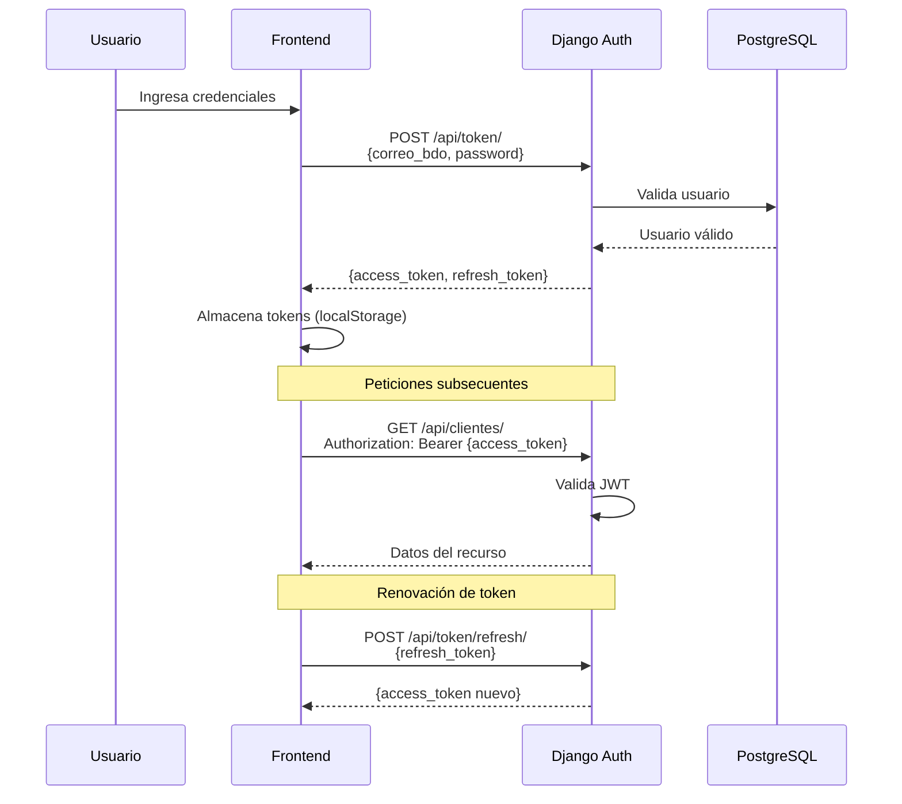
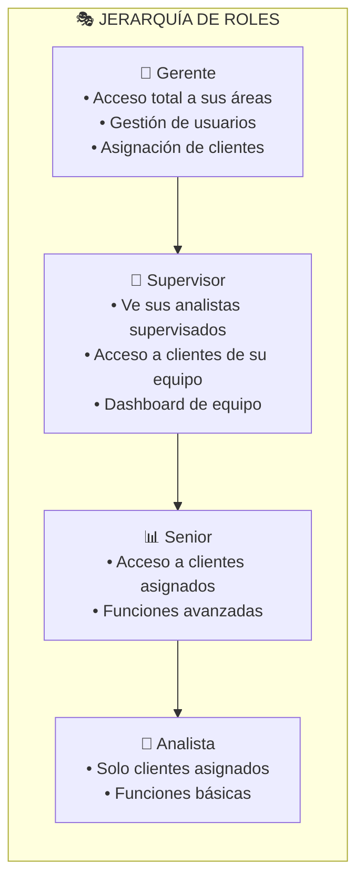
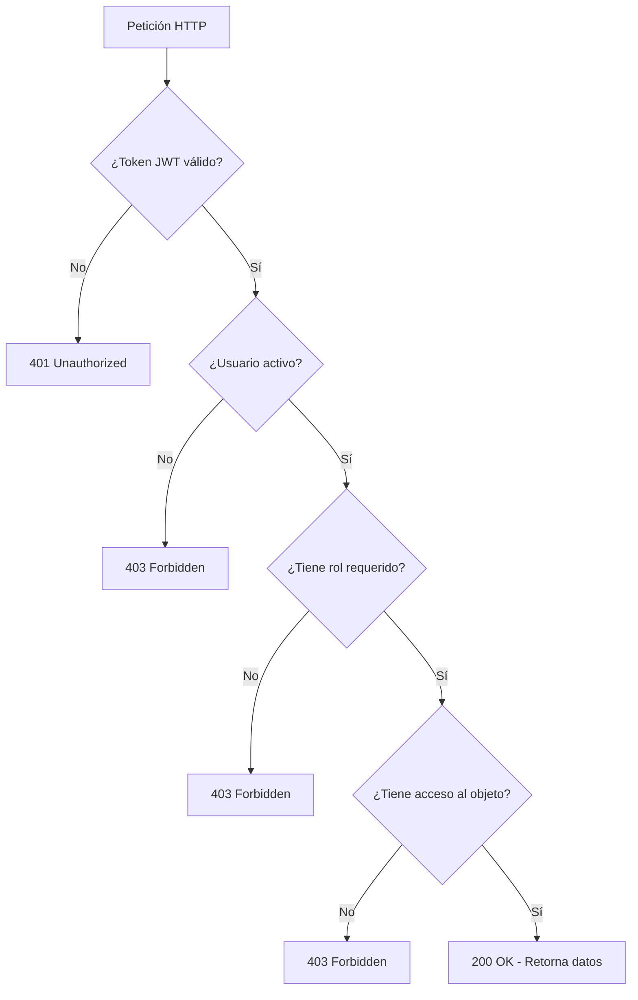
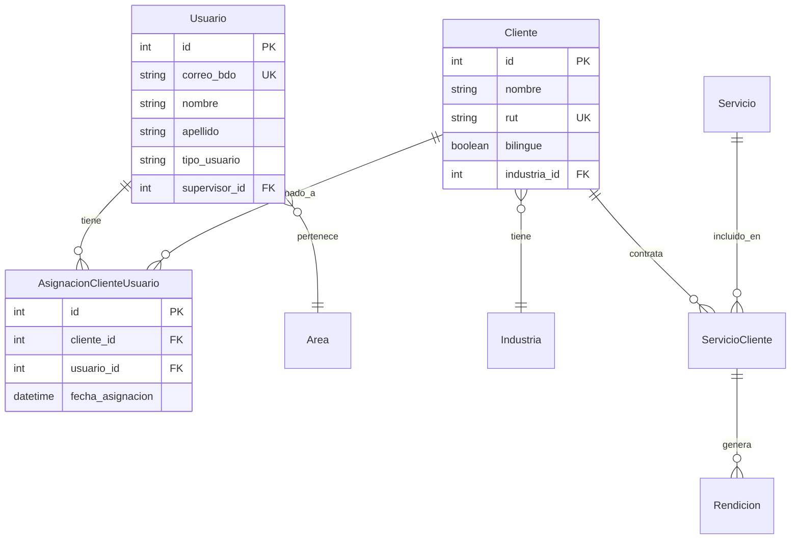

# 📚 Documentación del Sistema SGM Contabilidad

**Versión:** 1.1  
**Fecha:** 28 de Noviembre de 2025  
**Autor:** BDO Chile - Equipo de Desarrollo

---

## 📑 Índice

1. [Diagrama de Arquitectura](#1-diagrama-de-arquitectura)
2. [Flujo de Autenticación y Autorización](#2-flujo-de-autenticación-y-autorización)
3. [Inventario de Tecnologías](#3-inventario-de-tecnologías)
4. [Descripción de APIs Expuestas](#4-descripción-de-apis-expuestas)
5. [Configuración de Seguridad](#5-configuración-de-seguridad)

---

## 1. Diagrama de Arquitectura

### 1.1 Vista General del Sistema



### 1.2 Arquitectura de Servidores



### 1.3 Flujo de Datos - Procesamiento Excel



---

## 2. Flujo de Autenticación y Autorización

### 2.1 Mecanismo de Autenticación

El sistema utiliza **JWT (JSON Web Tokens)** implementado con `djangorestframework-simplejwt`.



### 2.2 Configuración JWT

```python
# backend/sgm_backend/settings.py
SIMPLE_JWT = {
    'ACCESS_TOKEN_LIFETIME': timedelta(hours=8),    # Jornada laboral completa
    'REFRESH_TOKEN_LIFETIME': timedelta(days=3),    # Balance seguridad/comodidad
    'ROTATE_REFRESH_TOKENS': True,                  # Nuevo refresh token cada uso
    'BLACKLIST_AFTER_ROTATION': True,               # Invalida tokens rotados
    'UPDATE_LAST_LOGIN': True,                      # Actualiza último login
}
```

### 2.3 Sistema de Roles y Permisos



### 2.4 Clases de Permisos Personalizados

| Clase | Descripción | Uso |
|-------|-------------|-----|
| `IsGerente` | Solo usuarios con `tipo_usuario='gerente'` | Gestión de analistas, asignaciones |
| `IsSupervisor` | Solo supervisores | Dashboard de equipo supervisado |
| `IsAnalista` | Solo analistas | Vistas básicas de clientes |
| `IsAuthenticatedAndActive` | Autenticados y activos | Todos los endpoints protegidos |
| `ClienteAccess` | Acceso según rol a clientes | ViewSets de clientes |
| `IsGerenteOrSelfOrReadOnly` | Gerente o propietario | Asignaciones cliente-usuario |

### 2.5 Control de Acceso por Recurso

```python
# Ejemplo de implementación en ViewSet
class ClienteViewSet(viewsets.ModelViewSet):
    permission_classes = [IsAuthenticatedAndActive, ClienteAccess]

    def get_queryset(self):
        qs = super().get_queryset()
        if self.request.user.tipo_usuario == 'analista':
            # Analistas solo ven sus clientes asignados
            asignados = AsignacionClienteUsuario.objects.filter(
                usuario=self.request.user
            ).values_list('cliente_id', flat=True)
            return qs.filter(pk__in=asignados)
        return qs  # Gerentes ven todos
```

### 2.6 Validación de Acceso a Recursos



---

## 3. Inventario de Tecnologías

### 3.1 Frontend

| Tecnología | Versión | Propósito |
|------------|---------|-----------|
| **React** | 19.0.0 | Framework UI principal |
| **Vite** | 7.2.4 | Build tool y dev server |
| **React Router DOM** | 7.3.0 | Enrutamiento SPA |
| **TailwindCSS** | 4.0.13 | Framework CSS utility-first |
| **DaisyUI** | 5.0.3 | Componentes UI para Tailwind |
| **Axios** | 1.9.0 | Cliente HTTP |
| **Recharts** | 2.15.2 | Gráficos y visualizaciones |
| **Framer Motion** | 12.7.3 | Animaciones |
| **Lucide React** | 0.488.0 | Iconos |
| **React Select** | 5.10.1 | Selectores avanzados |

### 3.2 Backend

| Tecnología | Versión | Propósito |
|------------|---------|-----------|
| **Django** | 5.2.8 | Framework web principal |
| **Django REST Framework** | 3.16.0 | API REST |
| **djangorestframework-simplejwt** | 5.5.1 | Autenticación JWT |
| **Celery** | 5.5.2 | Procesamiento asíncrono |
| **Redis** | 6.0.0 | Broker de mensajes y caché |
| **Gunicorn** | 23.0.0 | Servidor WSGI producción |
| **WhiteNoise** | 6.9.0 | Archivos estáticos |
| **Pandas** | 2.2.3 | Procesamiento de datos |
| **OpenPyXL** | 3.1.5 | Manipulación de Excel |
| **psycopg2-binary** | 2.9.10 | Driver PostgreSQL |
| **django-cors-headers** | 4.7.0 | Configuración CORS |
| **django-redis** | >=5.4.0 | Cache con Redis |

### 3.3 Base de Datos

| Componente | Tecnología | Propósito |
|------------|------------|-----------|
| **Base de datos principal** | PostgreSQL | Almacenamiento persistente |
| **Cache** | Redis 7.2 | Sesiones, cache de queries |
| **Cola de tareas** | Redis 7.2 | Broker para Celery |

### 3.4 Infraestructura y DevOps

| Componente | Tecnología | Propósito |
|------------|------------|-----------|
| **Contenedores** | Docker + Docker Compose | Despliegue y orquestación |
| **CI/CD** | GitHub Actions | Automatización de deploys |
| **Runner** | Self-hosted runner | Ejecución de workflows |
| **Monitoreo Celery** | Flower | Dashboard de tareas |
| **Monitoreo Redis** | Redis Insight | Visualización de datos |

### 3.5 Árbol de Dependencias Simplificado

```
SGM-Contabilidad/
├── Frontend (npm)
│   ├── react@19.0.0
│   ├── vite@7.2.4 (dev)
│   ├── tailwindcss@4.0.13
│   └── axios@1.9.0
│
├── Backend (pip)
│   ├── Django@5.2.8
│   ├── djangorestframework@3.16.0
│   ├── celery@5.5.2
│   ├── redis@6.0.0
│   └── pandas@2.2.3
│
└── Infraestructura (Docker)
    ├── redis:7.2.5
    ├── mher/flower (Celery monitor)
    └── redis/redisinsight (Redis GUI)
```

---

## 4. Descripción de APIs Expuestas

### 4.1 Endpoints de Autenticación

| Método | Endpoint | Descripción | Autenticación |
|--------|----------|-------------|---------------|
| `POST` | `/api/token/` | Obtener access y refresh token | No |
| `POST` | `/api/token/refresh/` | Renovar access token | Refresh token |

**Ejemplo de Login:**
```bash
curl -X POST http://localhost:8000/api/token/ \
  -H "Content-Type: application/json" \
  -d '{"correo_bdo": "usuario@bdo.cl", "password": "secreto"}'

# Respuesta
{
  "access": "eyJ0eXAiOiJKV1QiLCJhbGc...",
  "refresh": "eyJ0eXAiOiJKV1QiLCJhbGc..."
}
```

### 4.2 Endpoints de Usuarios

| Método | Endpoint | Descripción | Permisos |
|--------|----------|-------------|----------|
| `GET` | `/api/usuarios/` | Listar usuarios | Gerente, Supervisor |
| `GET` | `/api/usuarios/me/` | Usuario actual | Autenticado |
| `GET` | `/api/usuarios/mis-analistas/` | Analistas supervisados | Supervisor |
| `GET` | `/api/usuarios/clientes-supervisados/` | Clientes de equipo | Supervisor |
| `POST` | `/api/usuarios/{id}/asignar-supervisor/` | Asignar supervisor | Gerente |

### 4.3 Endpoints de Clientes

| Método | Endpoint | Descripción | Permisos |
|--------|----------|-------------|----------|
| `GET` | `/api/clientes/` | Listar clientes | Según rol |
| `GET` | `/api/clientes/asignados/` | Clientes asignados al usuario | Autenticado |
| `GET` | `/api/clientes/{id}/servicios/` | Servicios del cliente | Autenticado |
| `GET` | `/api/clientes/{id}/servicios-area/` | Servicios por área del usuario | Autenticado |

### 4.4 Endpoints de Asignaciones

| Método | Endpoint | Descripción | Permisos |
|--------|----------|-------------|----------|
| `GET` | `/api/asignaciones/` | Listar asignaciones | Según rol |
| `POST` | `/api/asignaciones/` | Crear asignación | Gerente |
| `DELETE` | `/api/asignaciones/{analista_id}/{cliente_id}/` | Remover asignación | Gerente |
| `GET` | `/api/clientes-disponibles/{analista_id}/` | Clientes sin asignar | Gerente |
| `GET` | `/api/clientes-asignados/{analista_id}/` | Clientes de un analista | Gerente |

### 4.5 Endpoints de Rinde Gastos (Captura Masiva)

| Método | Endpoint | Descripción | Permisos |
|--------|----------|-------------|----------|
| `POST` | `/api/rindegastos/leer-headers/` | Leer headers de Excel | Autenticado |
| `POST` | `/api/rindegastos/step1/iniciar/` | Iniciar procesamiento | Autenticado |
| `GET` | `/api/rindegastos/step1/estado/{task_id}/` | Estado de tarea | Autenticado |
| `GET` | `/api/rindegastos/step1/descargar/{task_id}/` | Descargar resultado | Autenticado |
| `GET` | `/api/rindegastos/centros-costo/` | Listar centros de costo | Autenticado |
| `GET` | `/api/rindegastos/tipos-documento/` | Listar tipos de documento | Autenticado |
| `GET` | `/api/rindegastos/cuentas-globales/` | Listar cuentas globales | Autenticado |
| `GET` | `/api/rindegastos/rendiciones/` | Historial de rendiciones | Autenticado |

### 4.6 Endpoints Auxiliares

| Método | Endpoint | Descripción | Permisos |
|--------|----------|-------------|----------|
| `GET` | `/api/areas/` | Listar áreas | Gerente |
| `GET` | `/api/industrias/` | Listar industrias | Autenticado |
| `GET` | `/api/servicios/` | Listar servicios | Autenticado |
| `GET` | `/api/ping/` | Health check del sistema | Autenticado |

### 4.7 Endpoints Deshabilitados

> **⚠️ IMPORTANTE:** Los siguientes endpoints han sido **deshabilitados** y ya no están disponibles en el sistema:

#### 4.7.1 Dashboard y Business Intelligence
- ❌ `GET /api/dashboard/` - Dashboard ejecutivo con KPIs
- ❌ `GET /api/bi-analistas/` - Performance de analistas
- ❌ `GET /api/analistas-detallado/` - Análisis detallado de analistas
- ❌ `GET /api/analistas-detallado/{id}/estadisticas/` - Estadísticas de un analista

#### 4.7.2 Endpoints Exclusivos de Gerente
- ❌ `GET /api/gerente/clientes/` - Vista completa de clientes
- ❌ `POST /api/gerente/clientes/reasignar/` - Reasignar cliente a analista
- ❌ `GET /api/gerente/clientes/{id}/perfil-completo/` - Perfil detallado de cliente
- ❌ `GET /api/gerente/metricas/` - Métricas avanzadas del sistema
- ❌ `GET /api/gerente/analisis-portafolio/` - Análisis de portafolio completo
- ❌ `GET /api/gerente/alertas/` - Sistema de alertas
- ❌ `PATCH /api/gerente/alertas/{id}/marcar-leida/` - Marcar alerta como leída
- ❌ `GET /api/gerente/alertas/configuracion/` - Configuración de alertas
- ❌ `POST /api/gerente/alertas/configurar/` - Configurar umbrales de alertas
- ❌ `POST /api/gerente/reportes/generar/` - Generar reporte
- ❌ `GET /api/gerente/reportes/historial/` - Historial de reportes
- ❌ `GET /api/gerente/reportes/{id}/descargar/` - Descargar reporte

#### 4.7.3 Cobranza (CxC)
- ❌ `POST /api/cobranza/parse-auxiliar/` - Parser de auxiliar CxC

**Motivo de deshabilitación:** Simplificación del sistema y enfoque en funcionalidades core. El código está preservado en `backend/api/views.py` (comentado) y `backend/api/urls_gerente.py.disabled` para referencia futura.

### 4.8 Formato de Respuestas de Error

```json
// 401 Unauthorized
{
  "detail": "Las credenciales de autenticación no fueron provistas."
}

// 403 Forbidden
{
  "detail": "No tiene permiso para realizar esta acción."
}

// 400 Bad Request
{
  "error": "Descripción del error específico"
}

// 404 Not Found
{
  "detail": "No encontrado."
}
```

### 4.9 Paginación

Los endpoints que retornan listas soportan paginación por defecto de Django REST Framework:

```bash
GET /api/clientes/?page=1&page_size=20
```

### 4.10 Resumen de Endpoints por Categoría

| Categoría | Endpoints Activos | Endpoints Deshabilitados |
|-----------|-------------------|--------------------------|
| **Autenticación** | 2 | 0 |
| **Usuarios** | 5 | 0 |
| **Clientes** | 4 | 0 |
| **Asignaciones** | 5 | 0 |
| **Rinde Gastos** | 8 | 0 |
| **Dashboard/BI** | 0 | 4 |
| **Gerente** | 0 | 12 |
| **Cobranza** | 0 | 1 |
| **Auxiliares** | 4 | 0 |
| **TOTAL** | **28** | **17** |

---

## 5. Configuración de Seguridad

### 5.1 Headers HTTP de Seguridad

El sistema implementa headers de seguridad a través del middleware de Django:

```python
# Configuración en settings.py
MIDDLEWARE = [
    'corsheaders.middleware.CorsMiddleware',           # CORS
    'django.middleware.security.SecurityMiddleware',   # Headers de seguridad
    'whitenoise.middleware.WhiteNoiseMiddleware',      # Archivos estáticos
    'django.middleware.csrf.CsrfViewMiddleware',       # Protección CSRF
    'django.middleware.clickjacking.XFrameOptionsMiddleware',  # X-Frame-Options
    # ...
]
```

### 5.2 Configuración CORS

```python
# Desarrollo (DEBUG=True)
CORS_ALLOWED_ORIGINS = [
    "http://localhost:5174",        # Vite dev server local
    "http://172.17.11.13:5174",     # Vite en servidor producción
    "http://172.17.11.22:5174",     # Vite en servidor desarrollo
    "http://172.17.11.13:8000",     # Django producción
    "http://172.17.11.22:8000",     # Django desarrollo
]

# Producción (DEBUG=False)
CORS_ALLOWED_ORIGINS = [
    "http://172.17.11.13:8000",     # Producción
    "http://172.17.11.22:8000",     # Desarrollo
]

# Configuración adicional
CORS_ALLOW_CREDENTIALS = True
CORS_ALLOW_HEADERS = [
    'accept', 'accept-encoding', 'authorization',
    'content-type', 'dnt', 'origin', 'user-agent',
    'x-csrftoken', 'x-requested-with',
]
CORS_ALLOW_METHODS = ['DELETE', 'GET', 'OPTIONS', 'PATCH', 'POST', 'PUT']
```

### 5.3 Validación de Contraseñas

```python
AUTH_PASSWORD_VALIDATORS = [
    {'NAME': 'django.contrib.auth.password_validation.UserAttributeSimilarityValidator'},
    {'NAME': 'django.contrib.auth.password_validation.MinimumLengthValidator'},
    {'NAME': 'django.contrib.auth.password_validation.CommonPasswordValidator'},
    {'NAME': 'django.contrib.auth.password_validation.NumericPasswordValidator'},
]
```

### 5.4 Protección Redis

```python
# Redis con contraseña obligatoria
REDIS_PASSWORD = os.environ.get('REDIS_PASSWORD')
if not REDIS_PASSWORD:
    raise ImproperlyConfigured("REDIS_PASSWORD environment variable is required")

REDIS_URL = f"redis://:{REDIS_PASSWORD}@redis:6379/0"
```

### 5.5 Configuración de Archivos y Uploads

```python
# Límites de tamaño para prevenir DoS
DATA_UPLOAD_MAX_NUMBER_FIELDS = 200000  # Para formularios grandes
DATA_UPLOAD_MAX_MEMORY_SIZE = 5242880   # 5MB para uploads
FILE_UPLOAD_MAX_MEMORY_SIZE = 5242880   # 5MB para archivos
```

### 5.6 Variables de Entorno Sensibles

Las siguientes variables **NUNCA** deben commitearse y deben configurarse en el archivo `.env`:

| Variable | Descripción | Ejemplo |
|----------|-------------|---------|
| `SECRET_KEY` | Clave secreta de Django | `django-insecure-abc123...` |
| `POSTGRES_PASSWORD` | Contraseña de PostgreSQL | `password_seguro_aqui` |
| `REDIS_PASSWORD` | Contraseña de Redis | `redis_password_aqui` |
| `DEBUG` | Modo debug (False en producción) | `False` |

### 5.7 Configuración de Producción vs Desarrollo

| Aspecto | Desarrollo | Producción |
|---------|------------|------------|
| `DEBUG` | `True` | `False` |
| Servidor web | `runserver` | Gunicorn (3 workers) |
| CORS | Orígenes amplios | Orígenes restringidos |
| Logs | Debug level | Warning level |
| Static files | Django serve | WhiteNoise |
| Token lifetime | 8 horas | 8 horas |

### 5.8 Checklist de Seguridad

- [x] JWT para autenticación stateless
- [x] CORS configurado por ambiente
- [x] Redis protegido con contraseña
- [x] Contraseñas validadas con políticas
- [x] Variables sensibles en `.env`
- [x] X-Frame-Options habilitado
- [x] CSRF protection activo
- [x] Límites de upload configurados
- [x] Permisos por rol implementados
- [x] Tokens con rotación automática
- [x] Blacklist de tokens rotados

### 5.9 Recomendaciones Futuras

1. **HTTPS**: Implementar certificado SSL/TLS con Let's Encrypt
2. **Nginx**: Agregar proxy reverso para protección adicional
3. **Rate Limiting**: Implementar throttling en endpoints críticos
4. **Auditoría**: Agregar logging de accesos y cambios sensibles
5. **2FA**: Considerar autenticación de dos factores para gerentes

---

## 📎 Anexos

### A. Modelo de Datos Simplificado



### B. Variables de Entorno Requeridas

```bash
# .env.example
# Base de datos
POSTGRES_DB=sgm_db
POSTGRES_USER=sgm_user
POSTGRES_PASSWORD=tu_password_seguro
POSTGRES_HOST=db
POSTGRES_PORT=5432

# Django
SECRET_KEY=tu_secret_key_django
DEBUG=False
ALLOWED_HOSTS=localhost,127.0.0.1,tu-dominio.com

# Redis
REDIS_PASSWORD=tu_redis_password

# Celery (opcional, usa valores de Redis)
# CELERY_BROKER_URL=redis://:password@redis:6379/0
```

---

**Documento generado para BDO Chile - SGM Contabilidad**  
**Última actualización:** Noviembre 2025

---

## �� Historial de Cambios

### [v1.1] - 28 de Noviembre 2025

**Eliminación de Endpoints**
- ❌ Deshabilitados 17 endpoints de Dashboard, BI, Gerente y Cobranza
- 📝 Código preservado en archivos comentados para referencia futura
- ✅ Sistema simplificado enfocado en funcionalidades core
- 🎯 28 endpoints activos en producción

**Archivos afectados:**
- `backend/api/urls.py` - Eliminadas rutas de BI/Dashboard/Gerente/Cobranza
- `backend/api/views.py` - ViewSets comentados para referencia
- `backend/api/urls_gerente.py` - Renombrado a `.disabled`

**Commits relacionados:**
- `e6e220f4` - feat: Eliminar endpoints de BI, Dashboard, Gerente y Cobranza
- `2201e17d` - fix: Corregir error de sintaxis en comentarios de views.py
