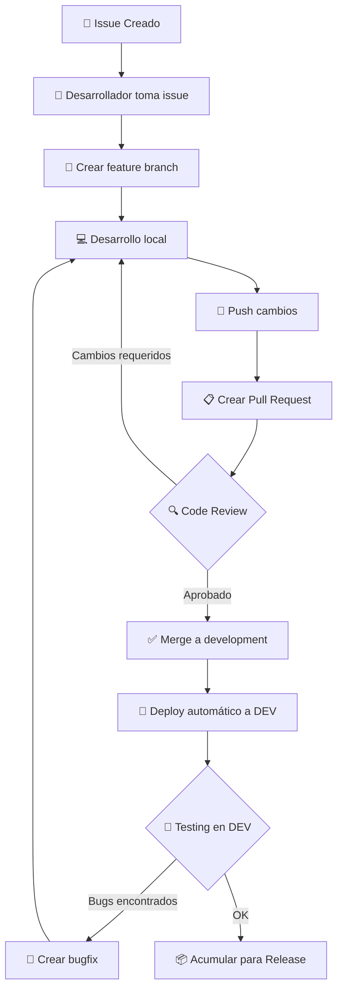
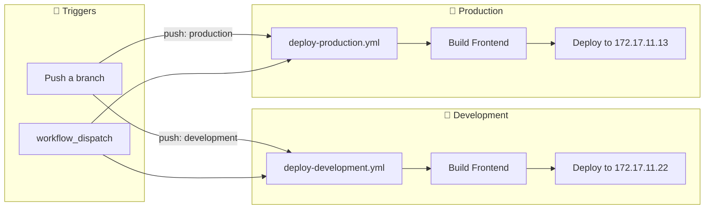
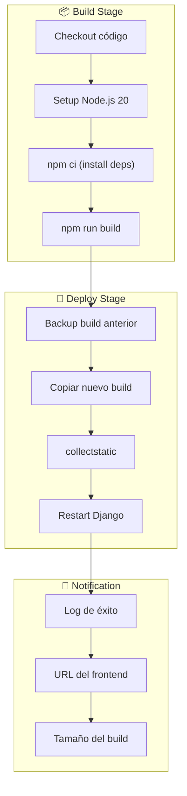
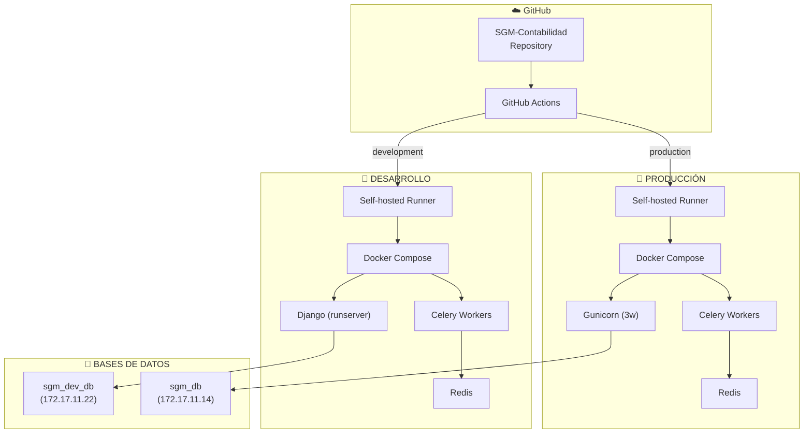
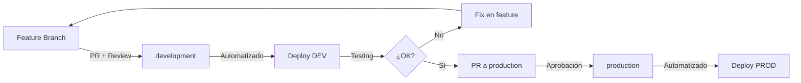
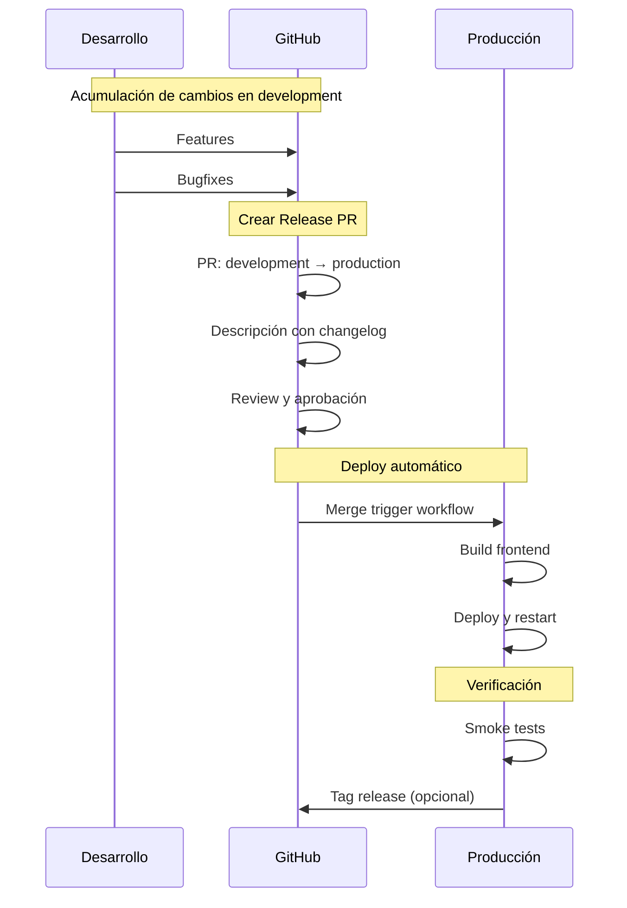
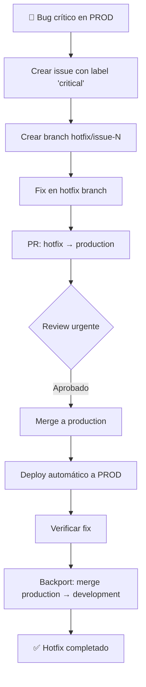
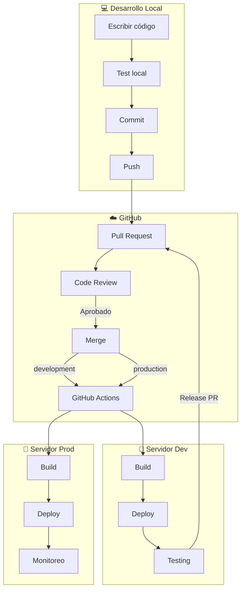

# 🔄 Metodología CI/CD - SGM Contabilidad

**Versión:** 1.0  
**Fecha:** Noviembre 2025  
**Autor:** BDO Chile - Equipo de Desarrollo

---

## 📑 Índice

1. [Introducción](#1-introducción)
2. [Flujo de Trabajo Git](#2-flujo-de-trabajo-git)
3. [Pipelines de CI/CD](#3-pipelines-de-cicd)
4. [Ambientes de Despliegue](#4-ambientes-de-despliegue)
5. [Proceso de Release](#5-proceso-de-release)
6. [Buenas Prácticas](#6-buenas-prácticas)

---

## 1. Introducción

### 1.1 ¿Qué es CI/CD?

**CI (Integración Continua):** Práctica de integrar cambios de código frecuentemente, validando automáticamente que no rompan el sistema existente.

**CD (Despliegue/Entrega Continua):** Automatización del proceso de despliegue para entregar cambios a los usuarios de forma rápida y segura.

### 1.2 Objetivos del CI/CD en SGM

- ✅ **Automatización**: Eliminar pasos manuales propensos a errores
- ✅ **Velocidad**: Reducir tiempo de entrega de nuevas funcionalidades
- ✅ **Calidad**: Detectar problemas tempranamente
- ✅ **Trazabilidad**: Historial completo de cambios y despliegues
- ✅ **Consistencia**: Procesos repetibles y predecibles

### 1.3 Herramientas Utilizadas

| Herramienta | Propósito |
|-------------|-----------|
| **GitHub** | Repositorio de código y gestión de issues |
| **GitHub Actions** | Automatización de CI/CD |
| **Self-hosted Runner** | Ejecución de workflows en servidores propios |
| **Docker Compose** | Orquestación de contenedores |

---

## 2. Flujo de Trabajo Git

### 2.1 Estructura de Ramas

```mermaid
gitGraph
    commit id: "Initial"
    branch development
    checkout development
    commit id: "Feature A"
    branch feature/issue-1
    checkout feature/issue-1
    commit id: "WIP Feature"
    commit id: "Complete"
    checkout development
    merge feature/issue-1 id: "Merge PR #1"
    branch feature/issue-2
    checkout feature/issue-2
    commit id: "Feature B"
    checkout development
    merge feature/issue-2 id: "Merge PR #2"
    checkout main
    merge development id: "Release v1.0" tag: "v1.0"
    branch production
    checkout production
    merge main id: "Deploy"
```

### 2.2 Ramas Principales

| Rama | Propósito | Servidor | Protección |
|------|-----------|----------|------------|
| `production` | Código en producción | 172.17.11.13 | ✅ Protegida |
| `development` | Código en desarrollo | 172.17.11.22 | ✅ Protegida |
| `feature/*` | Desarrollo de funcionalidades | Local | ❌ Temporal |
| `bugfix/*` | Corrección de bugs | Local | ❌ Temporal |
| `hotfix/*` | Correcciones urgentes | Local | ❌ Temporal |

### 2.3 Convención de Nombres de Ramas

```
tipo/issue-N-descripcion-corta

Ejemplos:
├── feature/issue-15-nuevo-reporte
├── bugfix/issue-23-corregir-validacion
├── hotfix/issue-99-critical-auth
└── docs/issue-42-actualizar-readme
```

### 2.4 Flujo de Desarrollo



### 2.5 Convención de Commits

```
tipo: descripción corta

[Cuerpo opcional con más detalles]

Refs #N o Closes #N
```

**Tipos de commit:**

| Tipo | Descripción |
|------|-------------|
| `feat:` | Nueva funcionalidad |
| `fix:` | Corrección de bug |
| `refactor:` | Refactorización sin cambio funcional |
| `docs:` | Solo documentación |
| `style:` | Formato, espacios, punto y coma |
| `test:` | Agregar o modificar tests |
| `chore:` | Tareas de mantenimiento |

**Ejemplo:**
```bash
git commit -m "feat: Agregar filtro de fechas al reporte

- Implementar DatePicker component
- Agregar validación de rango
- Actualizar API endpoint con parámetros

Closes #15"
```

---

## 3. Pipelines de CI/CD

### 3.1 Arquitectura de Workflows



### 3.2 Workflow de Desarrollo

**Archivo:** `.github/workflows/deploy-development.yml`

```yaml
name: Deploy to Development

on:
  push:
    branches:
      - development
  workflow_dispatch:  # Permite ejecución manual

jobs:
  build-and-deploy:
    runs-on: self-hosted
    
    steps:
      - name: Checkout code
        uses: actions/checkout@v4
      
      - name: Setup Node.js
        uses: actions/setup-node@v4
        with:
          node-version: '20'
          cache: 'npm'
      
      - name: Install dependencies
        run: npm ci
      
      - name: Build frontend
        env:
          VITE_MEDIA_BASE_URL: http://172.17.11.22:8000
        run: npm run build
      
      - name: Deploy to Django static
        run: |
          # Backup anterior
          if [ -d "/home/outcontab1/dev/sgm-contabilidad/backend/static/dist" ]; then
            mv /home/outcontab1/dev/sgm-contabilidad/backend/static/dist /home/outcontab1/dev/sgm-contabilidad/backend/static/dist.backup
          fi
          # Copiar nuevo build
          cp -r dist /home/outcontab1/dev/sgm-contabilidad/backend/static/
      
      - name: Collect static files
        run: docker compose exec -T django python manage.py collectstatic --noinput
      
      - name: Restart Django
        run: docker compose restart django
```

### 3.3 Workflow de Producción

**Archivo:** `.github/workflows/deploy-production.yml`

```yaml
name: Deploy to Production

on:
  push:
    branches:
      - production
  workflow_dispatch:

jobs:
  build-and-deploy:
    runs-on: self-hosted
    
    steps:
      # Similar a desarrollo pero con:
      # VITE_MEDIA_BASE_URL: http://172.17.11.13:8000
```

### 3.4 Pasos del Pipeline



### 3.5 Self-Hosted Runner

El sistema utiliza runners auto-hospedados en los servidores de BDO para ejecutar los workflows.

**Ubicación del Runner:**
- Producción: `172.17.11.13`
- Desarrollo: `172.17.11.22`

**Configuración:**
```bash
# Instalación del runner (una sola vez)
cd /home/outcontab1/actions-runner
./config.sh --url https://github.com/BDO-Chile/SGM-Contabilidad --token TOKEN

# Ejecutar como servicio
sudo ./svc.sh install
sudo ./svc.sh start
```

---

## 4. Ambientes de Despliegue

### 4.1 Comparación de Ambientes

| Aspecto | Desarrollo | Producción |
|---------|------------|------------|
| **Servidor** | 172.17.11.22 | 172.17.11.13 |
| **Branch** | `development` | `production` |
| **DEBUG** | `True` | `False` |
| **Servidor Web** | `runserver` | Gunicorn (3 workers) |
| **Base de Datos** | `sgm_dev_db` | `sgm_db` |
| **Logs** | Debug level | Warning level |
| **CORS** | Amplio | Restringido |

### 4.2 Diagrama de Ambientes



### 4.3 Proceso de Promoción



---

## 5. Proceso de Release

### 5.1 Tipos de Release

| Tipo | Descripción | Frecuencia | Ejemplo |
|------|-------------|------------|---------|
| **Regular** | Conjunto de features/fixes | Semanal | v1.2.0 |
| **Hotfix** | Corrección crítica urgente | Cuando sea necesario | v1.1.1 |
| **Major** | Cambios grandes o breaking | Trimestral | v2.0.0 |

### 5.2 Flujo de Release Regular



### 5.3 Plantilla de Release PR

```markdown
## 📦 Release v1.2.0 - [Fecha]

### ✨ Nuevas Funcionalidades
- #15 Nuevo reporte de consolidación mensual
- #17 Filtros avanzados en dashboard

### 🐛 Bug Fixes
- #18 Optimización de carga de datos
- #16 Validación de formato de email

### 🔧 Mejoras Técnicas
- #19 Refactoring de componente Header

### 🧪 Testing Realizado
- [x] Todas las funcionalidades probadas en desarrollo
- [x] Migrations verificadas
- [x] Performance aceptable
- [x] Revisión de seguridad

### ⚠️ Notas de Deployment
- Ejecutar migrations antes de reiniciar
- Limpiar caché de Redis si es necesario
```

### 5.4 Flujo de Hotfix



---

## 6. Buenas Prácticas

### 6.1 Antes de Crear un PR

- [ ] Código funciona localmente
- [ ] No hay errores de linting (`npm run lint`)
- [ ] Commit messages siguen convención
- [ ] Issue vinculado (`Closes #N` o `Refs #N`)
- [ ] Branch actualizado con `development`

### 6.2 Durante Code Review

- [ ] Revisar lógica del código
- [ ] Verificar manejo de errores
- [ ] Buscar posibles problemas de seguridad
- [ ] Validar que cumple con el issue
- [ ] Probar en ambiente de desarrollo

### 6.3 Después del Deploy

- [ ] Verificar que el deploy fue exitoso
- [ ] Realizar smoke tests básicos
- [ ] Monitorear logs por errores
- [ ] Actualizar issue/PR si hay problemas

### 6.4 Comandos Útiles

```bash
# Ver estado de workflows
gh run list

# Ver logs de un workflow específico
gh run view <run-id> --log

# Disparar workflow manualmente
gh workflow run deploy-development.yml

# Ver estado de contenedores
docker compose ps

# Ver logs de Django
docker compose logs -f django

# Reiniciar servicios
docker compose restart django celery_worker
```

### 6.5 Troubleshooting Común

| Problema | Posible Causa | Solución |
|----------|---------------|----------|
| Deploy falla en npm ci | Cache corrupto | Limpiar node_modules y cache |
| Static files no actualizan | collectstatic no ejecutado | `docker compose exec django python manage.py collectstatic --noinput` |
| Frontend no carga | Build no copiado | Verificar que dist existe en static/ |
| Worker no responde | Redis desconectado | `docker compose restart redis celery_worker` |

### 6.6 Contactos de Emergencia

En caso de problemas críticos en producción:

1. **Rollback inmediato:** Revertir al commit anterior
2. **Notificar al equipo:** Canal de comunicación definido
3. **Documentar incidente:** Crear issue con detalles

---

## 📎 Anexos

### A. Diagrama Completo del Flujo CI/CD



### B. Referencias

- [GitHub Actions Documentation](https://docs.github.com/en/actions)
- [Git Flow](https://nvie.com/posts/a-successful-git-branching-model/)
- [Conventional Commits](https://www.conventionalcommits.org/)
- [Docker Compose Documentation](https://docs.docker.com/compose/)

---

**Documento generado para BDO Chile - SGM Contabilidad**  
**Última actualización:** Noviembre 2025
