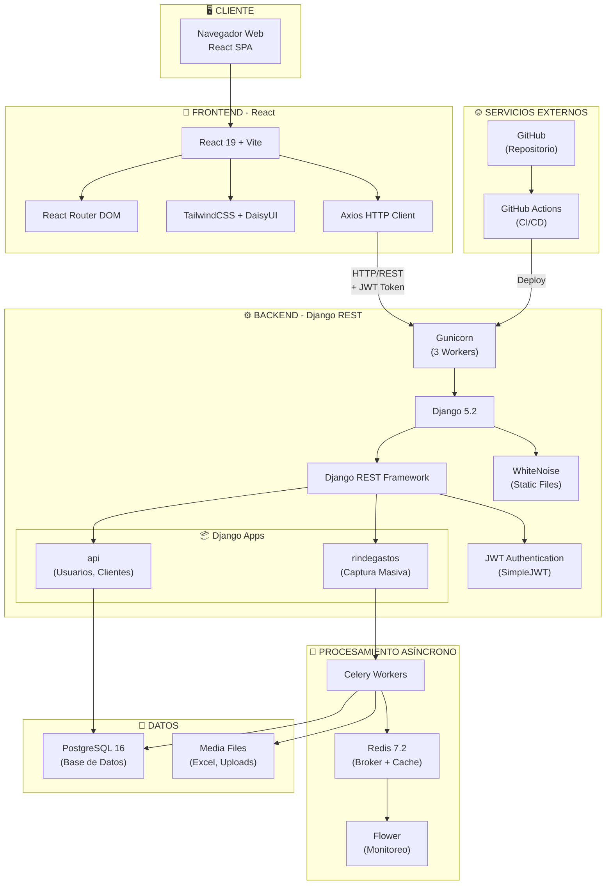
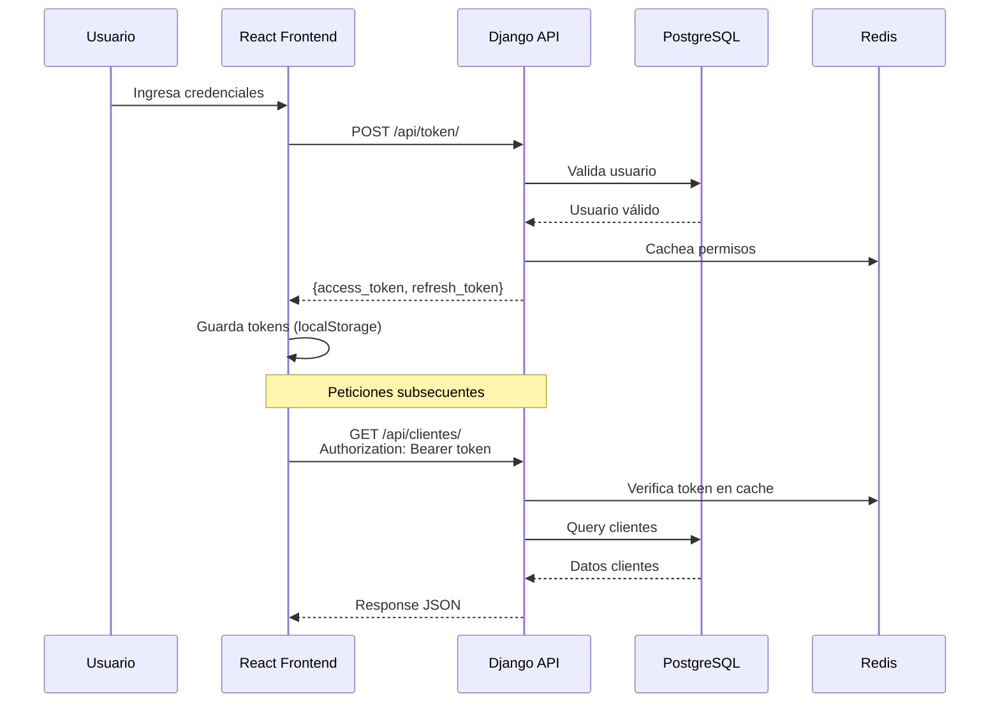
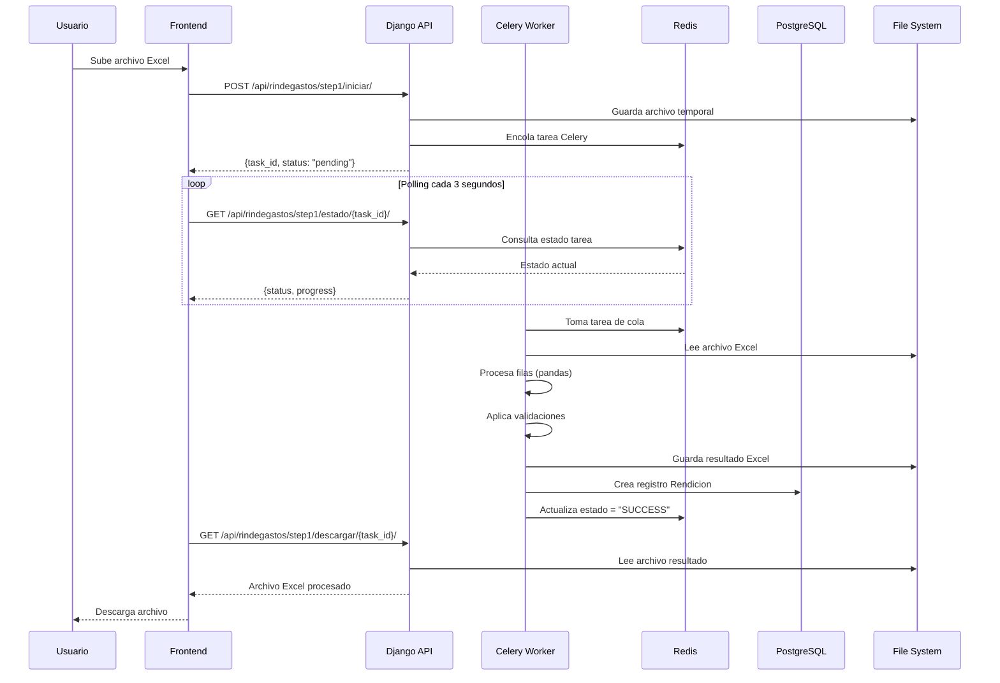
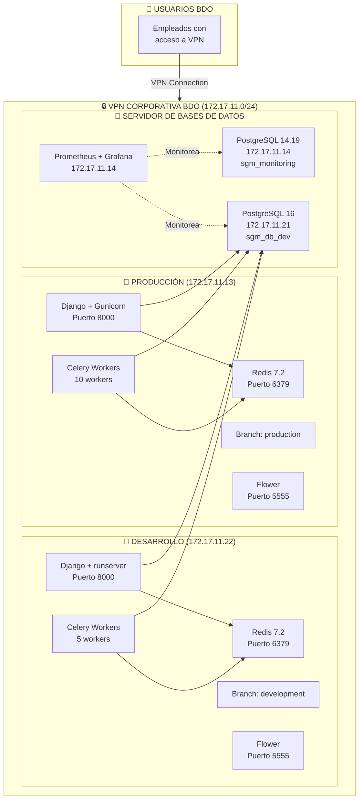
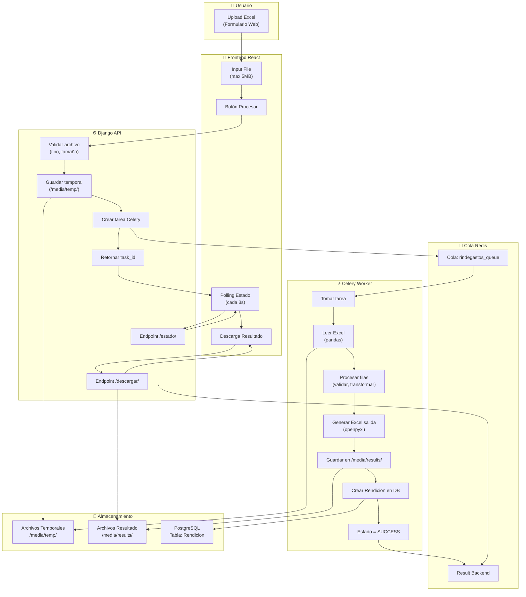
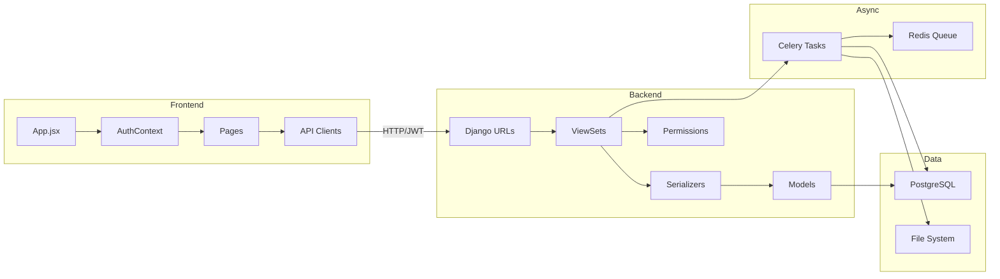

# Capítulo 2: Arquitectura del Sistema

**Parte I: Visión General del Sistema**  
**Documento:** SGM Contabilidad - Documentación Completa v2.0  
**Fecha:** 28 de Noviembre de 2025  

---

## 2.1 Vista General de Alto Nivel

### Diagrama de Arquitectura Completa



### Descripción de Componentes

#### 🖥️ Capa de Presentación
**Navegador Web del Cliente**
- SPA (Single Page Application) React
- Interfaz responsive y moderna
- Optimizada para Chrome, Firefox, Edge
- Resolución mínima: 1366x768

#### 📱 Frontend (React + Vite)
**Tecnologías:**
- React 19.0.0 con hooks modernos
- Vite 7.2.4 para desarrollo y build
- React Router DOM 7.3.0 para navegación
- TailwindCSS 4.0 + DaisyUI 5.0 para UI
- Axios 1.9.0 para peticiones HTTP

**Responsabilidades:**
- Renderizado de interfaces de usuario
- Manejo de estado local (hooks, context)
- Validación de formularios en cliente
- Comunicación con backend vía REST API
- Gestión de tokens JWT (localStorage)
- Routing y navegación SPA

#### ⚙️ Backend (Django REST Framework)
**Tecnologías:**
- Django 5.2.8 como framework web
- Django REST Framework 3.16.0 para APIs
- djangorestframework-simplejwt 5.5.1 para JWT
- Gunicorn 23.0.0 como servidor WSGI
- WhiteNoise 6.9.0 para archivos estáticos

**Responsabilidades:**
- Autenticación y autorización (JWT)
- Lógica de negocio
- Validación de datos en servidor
- Gestión de permisos por rol
- Endpoints REST API
- Integración con PostgreSQL
- Administración Django

#### 🔄 Procesamiento Asíncrono (Celery)
**Tecnologías:**
- Celery 5.5.2 para tareas asíncronas
- Redis 7.2 como message broker
- Flower para monitoreo de workers

**Responsabilidades:**
- Procesamiento de archivos Excel grandes
- Tareas de larga duración (background jobs)
- Generación de reportes
- Envío de emails (futuro)
- Tareas programadas (periodic tasks)

#### 💾 Capa de Persistencia
**PostgreSQL 16:**
- Base de datos relacional principal
- Almacena usuarios, clientes, asignaciones
- Histórico de rendiciones y resultados
- Configuraciones del sistema

**Redis 7.2:**
- Cache de queries frecuentes
- Message broker para Celery
- Sesiones de usuario
- Almacenamiento temporal de resultados

**Media Files:**
- Archivos Excel cargados
- Resultados procesados temporales
- Logs de procesamiento

#### 🌐 Servicios Externos
**GitHub:**
- Repositorio de código fuente
- Control de versiones
- Issues y project management

**GitHub Actions:**
- CI/CD pipeline automatizado
- Deploy a producción y desarrollo
- Tests automatizados (futuro)
- Linting y validación de código

### Patrones Arquitectónicos Aplicados

#### 1. **Arquitectura en Capas (Layered Architecture)**
```
┌─────────────────────────────────┐
│   PRESENTACIÓN (React SPA)      │
├─────────────────────────────────┤
│   API REST (Django DRF)         │
├─────────────────────────────────┤
│   LÓGICA DE NEGOCIO (Django)    │
├─────────────────────────────────┤
│   PERSISTENCIA (PostgreSQL)     │
└─────────────────────────────────┘
```

**Beneficios:**
- Separación clara de responsabilidades
- Fácil mantenimiento y testing
- Escalabilidad por capa
- Reutilización de componentes

#### 2. **Arquitectura Cliente-Servidor**
- Cliente: React SPA en navegador
- Servidor: Django API en backend
- Comunicación: HTTP REST + JSON
- Autenticación: JWT stateless

#### 3. **Microkernel Pattern (Django Apps)**
- Núcleo: Django core framework
- Plugins: Apps modulares (api, rindegastos)
- Extensible: Fácil agregar nuevas apps
- Independientes: Bajo acoplamiento entre apps

#### 4. **Message Queue Pattern**
- Productor: Django API
- Cola: Redis como broker
- Consumidor: Celery workers
- Resultado: Almacenado en Redis/DB

### Flujo de Datos Completo

#### Flujo de Autenticación


#### Flujo de Procesamiento Excel


---

## 2.2 Arquitectura de Servidores (Producción y Desarrollo)

### Vista de Infraestructura Física



### Especificaciones por Servidor

#### 🚀 Servidor Producción (vm-bdo-outcontab1 - 172.17.11.13)

**Hardware:**
- **CPU:** 4 cores
- **RAM:** 8 GB
- **Disco:** 100 GB SSD
- **OS:** Ubuntu 22.04 LTS

**Software Stack:**
```yaml
Servicios Activos:
  - Django 5.2.8 (Gunicorn 3 workers)
  - Celery 5.5.2 (10 workers)
  - Redis 7.2.5
  - Flower (puerto 5555)
  
Puertos:
  - 8000: Django API (HTTP)
  - 6379: Redis (internal)
  - 5555: Flower dashboard

Branch Git: production
Auto-Deploy: Sí (GitHub Actions)
Backup: Automático nocturno
```

**Configuración Docker Compose:**
```yaml
services:
  django:
    build: ./backend
    command: gunicorn sgm_backend.wsgi:application --bind 0.0.0.0:8000 --workers 3
    volumes:
      - ./backend:/app
      - static_volume:/app/staticfiles
      - media_volume:/app/media
    environment:
      - DEBUG=False
      - POSTGRES_HOST=172.17.11.21
    ports:
      - "8000:8000"
    depends_on:
      - redis

  celery:
    build: ./backend
    command: celery -A sgm_backend worker --loglevel=info --concurrency=10
    volumes:
      - ./backend:/app
      - media_volume:/app/media
    depends_on:
      - redis
      - django

  redis:
    image: redis:7.2-alpine
    command: redis-server --requirepass ${REDIS_PASSWORD}
    ports:
      - "6379:6379"
    volumes:
      - redis_data:/data

  flower:
    build: ./backend
    command: celery -A sgm_backend flower --port=5555
    ports:
      - "5555:5555"
    depends_on:
      - redis
      - celery

volumes:
  static_volume:
  media_volume:
  redis_data:
```

#### 🔧 Servidor Desarrollo (vm-bdo-q - 172.17.11.22)

**Hardware:**
- **CPU:** 2 cores
- **RAM:** 4 GB
- **Disco:** 50 GB SSD
- **OS:** Ubuntu 22.04 LTS

**Software Stack:**
```yaml
Servicios Activos:
  - Django 5.2.8 (runserver/Gunicorn)
  - Celery 5.5.2 (5 workers)
  - Redis 7.2.5
  - Flower (puerto 5555)
  
Puertos:
  - 8000: Django API (HTTP)
  - 6379: Redis (internal)
  - 5555: Flower dashboard

Branch Git: development
Auto-Deploy: Sí (GitHub Actions)
Backup: Semanal
```

**Diferencias con Producción:**
- `DEBUG=True` (más logging)
- Menos workers Celery (5 vs 10)
- Menos recursos de hardware
- CORS más permisivo para desarrollo local

#### 💾 Servidor Base de Datos (172.17.11.14)

**PostgreSQL 14.19 - Monitoreo**
```yaml
Función: Base de datos para Prometheus/Grafana
Puerto: 5432
Usuario: monitoring_user
Base de Datos: sgm_monitoring
Tamaño: ~500 MB
Conexiones: Máximo 20
```

**Stack de Monitoreo:**
- Prometheus 2.x
- Grafana 10.x
- postgres_exporter
- Dashboards PostgreSQL

#### 💾 Servidor DB Compartido (vmbdobases - 172.17.11.21)

**PostgreSQL 16**
```yaml
Función: Base de datos principal SGM
Puerto: 5432
Usuario: sgm_user
Base de Datos: sgm_db_dev
Tamaño: ~2 GB (crecimiento estimado)
Conexiones: Máximo 100
Configuración:
  - shared_buffers: 2GB
  - effective_cache_size: 8GB
  - max_connections: 100
  - work_mem: 32MB
```

**Optimizaciones:**
- Connection pooling habilitado
- Índices en queries frecuentes
- Vacuum automático configurado
- WAL archiving preparado

### Networking y Conectividad

#### Tabla de Conexiones

| Origen | Destino | Puerto | Protocolo | Propósito |
|--------|---------|--------|-----------|-----------|
| 172.17.11.13 | 172.17.11.21 | 5432 | TCP | Django → PostgreSQL |
| 172.17.11.22 | 172.17.11.21 | 5432 | TCP | Django → PostgreSQL |
| 172.17.11.13 | 172.17.11.13 | 6379 | TCP | Django/Celery → Redis |
| 172.17.11.22 | 172.17.11.22 | 6379 | TCP | Django/Celery → Redis |
| Usuarios VPN | 172.17.11.13 | 8000 | HTTP | Frontend → Django Prod |
| Usuarios VPN | 172.17.11.22 | 8000 | HTTP | Frontend → Django Dev |
| Usuarios VPN | 172.17.11.13 | 5555 | HTTP | Acceso Flower Prod |
| Usuarios VPN | 172.17.11.14 | 3000 | HTTP | Acceso Grafana |

#### Configuración de Firewall

**Producción (172.17.11.13):**
```bash
# UFW Rules
ufw allow from 172.17.11.0/24 to any port 8000  # Django API
ufw allow from 172.17.11.0/24 to any port 5555  # Flower
ufw deny from any to any port 6379              # Redis solo local
```

**Desarrollo (172.17.11.22):**
```bash
# UFW Rules
ufw allow from 172.17.11.0/24 to any port 8000  # Django API
ufw allow from 172.17.11.0/24 to any port 5555  # Flower
ufw deny from any to any port 6379              # Redis solo local
```

---

## 2.3 Flujo de Datos: Procesamiento de Excel

### Arquitectura de Procesamiento Asíncrono



### Etapas del Procesamiento

#### 1. **Upload y Validación (Frontend + API)**

**Frontend (React):**
```javascript
const handleFileUpload = async (file) => {
  // Validaciones en cliente
  if (!file.name.endsWith('.xlsx')) {
    return alert('Solo archivos .xlsx');
  }
  if (file.size > 5 * 1024 * 1024) {
    return alert('Archivo muy grande (max 5MB)');
  }

  // Crear FormData
  const formData = new FormData();
  formData.append('archivo', file);
  formData.append('cliente_id', selectedCliente);

  // Enviar a API
  const response = await axios.post(
    '/api/rindegastos/step1/iniciar/',
    formData,
    { headers: { 'Content-Type': 'multipart/form-data' } }
  );

  // Obtener task_id
  const { task_id } = response.data;
  startPolling(task_id);
};
```

**Backend (Django):**
```python
@action(detail=False, methods=['post'])
def iniciar(self, request):
    # Validar archivo
    archivo = request.FILES.get('archivo')
    if not archivo.name.endswith('.xlsx'):
        return Response({'error': 'Formato inválido'}, status=400)
    
    # Guardar temporal
    ruta_temp = f'/media/temp/{uuid.uuid4()}.xlsx'
    with open(ruta_temp, 'wb') as f:
        for chunk in archivo.chunks():
            f.write(chunk)
    
    # Encolar tarea Celery
    task = procesar_rinde_gastos.delay(
        ruta_archivo=ruta_temp,
        cliente_id=request.data.get('cliente_id'),
        usuario_id=request.user.id
    )
    
    return Response({
        'task_id': task.id,
        'status': 'pending'
    })
```

#### 2. **Procesamiento Asíncrono (Celery Worker)**

**Tarea Celery:**
```python
@shared_task(bind=True, queue='rindegastos_queue')
def procesar_rinde_gastos(self, ruta_archivo, cliente_id, usuario_id):
    try:
        # Actualizar progreso: 10%
        self.update_state(state='PROGRESS', meta={'progress': 10})
        
        # Leer Excel con pandas
        df = pd.read_excel(ruta_archivo)
        total_rows = len(df)
        
        # Validar headers
        required_cols = ['Fecha', 'Monto', 'Descripcion', ...]
        if not all(col in df.columns for col in required_cols):
            raise ValueError('Headers inválidos')
        
        # Actualizar progreso: 30%
        self.update_state(state='PROGRESS', meta={'progress': 30})
        
        # Procesar fila por fila
        resultados = []
        for idx, row in df.iterrows():
            # Validaciones
            validado = validar_fila(row)
            resultados.append(validado)
            
            # Update progress cada 100 filas
            if idx % 100 == 0:
                progress = 30 + (idx / total_rows) * 60
                self.update_state(state='PROGRESS', meta={'progress': progress})
        
        # Actualizar progreso: 90%
        self.update_state(state='PROGRESS', meta={'progress': 90})
        
        # Generar Excel resultado
        df_resultado = pd.DataFrame(resultados)
        ruta_salida = f'/media/results/{self.request.id}.xlsx'
        df_resultado.to_excel(ruta_salida, index=False)
        
        # Guardar en DB
        Rendicion.objects.create(
            task_id=self.request.id,
            usuario_id=usuario_id,
            cliente_id=cliente_id,
            archivo_original=ruta_archivo,
            archivo_resultado=ruta_salida,
            filas_procesadas=total_rows,
            estado='completado'
        )
        
        # Limpiar archivo temporal
        os.remove(ruta_archivo)
        
        return {
            'status': 'success',
            'filas_procesadas': total_rows,
            'ruta_resultado': ruta_salida
        }
        
    except Exception as e:
        # Log error
        logger.error(f"Error procesando: {str(e)}")
        return {
            'status': 'error',
            'error': str(e)
        }
```

#### 3. **Polling de Estado (Frontend)**

```javascript
const startPolling = (taskId) => {
  const interval = setInterval(async () => {
    const response = await axios.get(
      `/api/rindegastos/step1/estado/${taskId}/`
    );
    
    const { status, progress, error } = response.data;
    
    // Actualizar UI
    setProgress(progress);
    
    if (status === 'SUCCESS') {
      clearInterval(interval);
      setDownloadReady(true);
    } else if (status === 'FAILURE') {
      clearInterval(interval);
      alert(`Error: ${error}`);
    }
  }, 3000); // Cada 3 segundos
};
```

**Endpoint de Estado:**
```python
@action(detail=False, methods=['get'], url_path='estado/(?P<task_id>[^/.]+)')
def estado(self, request, task_id=None):
    task = AsyncResult(task_id)
    
    if task.state == 'PENDING':
        return Response({
            'status': 'pending',
            'progress': 0
        })
    elif task.state == 'PROGRESS':
        return Response({
            'status': 'processing',
            'progress': task.info.get('progress', 0)
        })
    elif task.state == 'SUCCESS':
        return Response({
            'status': 'success',
            'progress': 100,
            'result': task.info
        })
    elif task.state == 'FAILURE':
        return Response({
            'status': 'error',
            'error': str(task.info)
        }, status=500)
```

#### 4. **Descarga de Resultado**

```javascript
const handleDownload = async (taskId) => {
  const response = await axios.get(
    `/api/rindegastos/step1/descargar/${taskId}/`,
    { responseType: 'blob' }
  );
  
  // Crear link de descarga
  const url = window.URL.createObjectURL(new Blob([response.data]));
  const link = document.createElement('a');
  link.href = url;
  link.setAttribute('download', 'resultado_procesado.xlsx');
  document.body.appendChild(link);
  link.click();
  link.remove();
};
```

**Endpoint de Descarga:**
```python
@action(detail=False, methods=['get'], url_path='descargar/(?P<task_id>[^/.]+)')
def descargar(self, request, task_id=None):
    try:
        rendicion = Rendicion.objects.get(task_id=task_id)
        
        # Verificar permisos
        if rendicion.usuario != request.user:
            return Response({'error': 'Sin permisos'}, status=403)
        
        # Servir archivo
        archivo = open(rendicion.archivo_resultado, 'rb')
        response = FileResponse(archivo, content_type='application/vnd.openxmlformats-officedocument.spreadsheetml.sheet')
        response['Content-Disposition'] = f'attachment; filename="resultado_{task_id}.xlsx"'
        
        return response
        
    except Rendicion.DoesNotExist:
        return Response({'error': 'No encontrado'}, status=404)
```

### Manejo de Errores y Reintentos

**Configuración Celery:**
```python
# settings.py
CELERY_TASK_ACKS_LATE = True
CELERY_TASK_REJECT_ON_WORKER_LOST = True
CELERY_TASK_TIME_LIMIT = 3600  # 1 hora máximo
CELERY_TASK_SOFT_TIME_LIMIT = 3000  # 50 minutos warning

# Reintentos automáticos
@shared_task(
    bind=True,
    autoretry_for=(Exception,),
    retry_kwargs={'max_retries': 3, 'countdown': 60},
    queue='rindegastos_queue'
)
def procesar_rinde_gastos(self, ...):
    # Código de procesamiento
    pass
```

### Límites y Consideraciones

**Límites de Procesamiento:**
- **Filas máximas:** 200,000 por archivo
- **Tamaño máximo:** 5 MB
- **Timeout:** 1 hora (3600 segundos)
- **Workers concurrentes:** 10 (producción), 5 (desarrollo)
- **Memoria por worker:** ~500 MB

**Optimizaciones:**
- Procesamiento por chunks de pandas
- Liberación de memoria durante proceso
- Limpieza automática de archivos temporales (>7 días)
- Cache de queries frecuentes en Redis

---

## 2.4 Arquitectura de Red Corporativa

### Topología Completa

```
                    INTERNET PÚBLICO
                           │
                           │ (Sin acceso directo)
                           │
        ┌──────────────────▼─────────────────────┐
        │   FIREWALL CORPORATIVO BDO             │
        │   + VPN Gateway + IDS/IPS              │
        │   IP Pública: [Gestionada por IT BDO] │
        └──────────────────┬─────────────────────┘
                           │
        ┌──────────────────▼─────────────────────┐
        │      RED PRIVADA: 172.17.11.0/24      │
        │                                        │
        │  ┌─────────────────────────────────┐  │
        │  │  SERVIDOR PRODUCCIÓN            │  │
        │  │  vm-bdo-outcontab1              │  │
        │  │  172.17.11.13                   │  │
        │  │  • Django + Gunicorn (3 workers)│  │
        │  │  • Celery (10 workers)          │  │
        │  │  • Redis 7.2                    │  │
        │  │  • Flower :5555                 │  │
        │  │  • Branch: production           │  │
        │  └─────────────────────────────────┘  │
        │                                        │
        │  ┌─────────────────────────────────┐  │
        │  │  SERVIDOR DESARROLLO            │  │
        │  │  vm-bdo-q                       │  │
        │  │  172.17.11.22                   │  │
        │  │  • Django + Gunicorn (2 workers)│  │
        │  │  • Celery (5 workers)           │  │
        │  │  • Redis 7.2                    │  │
        │  │  • Flower :5555                 │  │
        │  │  • Branch: development          │  │
        │  └─────────────────────────────────┘  │
        │                                        │
        │  ┌─────────────────────────────────┐  │
        │  │  SERVIDOR BASE DE DATOS         │  │
        │  │  vm-bdo-outcontab2              │  │
        │  │  172.17.11.14                   │  │
        │  │  • PostgreSQL 14.19 :5432       │  │
        │  │  • Prometheus :9090             │  │
        │  │  • Grafana :3000                │  │
        │  │  • postgres_exporter :9187      │  │
        │  └─────────────────────────────────┘  │
        │                                        │
        │  ┌─────────────────────────────────┐  │
        │  │  SERVIDOR DB COMPARTIDO         │  │
        │  │  vmbdobases                     │  │
        │  │  172.17.11.21                   │  │
        │  │  • PostgreSQL 16 :5432          │  │
        │  │  • sgm_db_dev (Principal)       │  │
        │  │  • Conexiones: Max 100          │  │
        │  └─────────────────────────────────┘  │
        │                                        │
        └────────────────────────────────────────┘
                           ▲
                           │
                    VPN Connection
                           │
        ┌──────────────────┴─────────────────────┐
        │     USUARIOS CON ACCESO VPN BDO        │
        │  • Gerentes (3-5)                      │
        │  • Supervisores (8-12)                 │
        │  • Analistas (50-100)                  │
        │  • DevOps/SysAdmin (2-3)               │
        └────────────────────────────────────────┘
```

### Matriz de Comunicación entre Servicios

| Servicio Origen | Servicio Destino | Puerto | Protocolo | Propósito | Frecuencia |
|-----------------|------------------|--------|-----------|-----------|------------|
| Django (13) | PostgreSQL (21) | 5432 | TCP/SQL | Queries DB | Continuo |
| Django (22) | PostgreSQL (21) | 5432 | TCP/SQL | Queries DB | Continuo |
| Celery (13) | Redis (13) | 6379 | TCP/Redis | Broker tareas | Continuo |
| Celery (22) | Redis (22) | 6379 | TCP/Redis | Broker tareas | Continuo |
| Django (13) | Redis (13) | 6379 | TCP/Redis | Cache | Continuo |
| Frontend | Django (13) | 8000 | HTTP | API REST | Por request |
| Frontend | Django (22) | 8000 | HTTP | API REST | Por request |
| Admin | Flower (13) | 5555 | HTTP | Monitoreo | Por demanda |
| Admin | Grafana (14) | 3000 | HTTP | Dashboards | Por demanda |
| Prometheus (14) | postgres_exp (14) | 9187 | HTTP | Scrape metrics | Cada 15s |
| GitHub Actions | Prod (13) | 22 | SSH | Deploy | Por commit |
| GitHub Actions | Dev (22) | 22 | SSH | Deploy | Por commit |

---

## 2.5 Diagrama de Componentes Técnicos

### Vista de Componentes Frontend

```
frontend/
├── public/
│   └── plantillas/              # Plantillas Excel
├── src/
│   ├── main.jsx                 # Entry point
│   ├── App.jsx                  # Root component
│   │
│   ├── api/                     # API Clients
│   │   ├── config.js            # Axios config + interceptors
│   │   ├── authApi.js           # Auth endpoints
│   │   ├── clientesApi.js       # Clientes endpoints
│   │   ├── usuariosApi.js       # Usuarios endpoints
│   │   └── rindeGastosApi.js    # Rinde Gastos endpoints
│   │
│   ├── pages/                   # Páginas/Vistas
│   │   ├── Login.jsx
│   │   ├── Dashboard.jsx
│   │   ├── Clientes/
│   │   ├── Usuarios/
│   │   └── RindeGastos/
│   │
│   ├── components/              # Componentes reutilizables
│   │   ├── Navbar.jsx
│   │   ├── Sidebar.jsx
│   │   ├── Table.jsx
│   │   ├── FileUpload.jsx
│   │   └── ProgressBar.jsx
│   │
│   ├── hooks/                   # Custom hooks
│   │   ├── useAuth.js
│   │   ├── useApi.js
│   │   └── usePolling.js
│   │
│   ├── contexts/                # React Context
│   │   └── AuthContext.jsx
│   │
│   ├── utils/                   # Utilidades
│   │   ├── formatters.js
│   │   └── validators.js
│   │
│   └── constants/               # Constantes
│       └── roles.js
```

### Vista de Componentes Backend

```
backend/
├── manage.py
├── requirements.txt
│
├── sgm_backend/                 # Proyecto Django
│   ├── settings.py              # Configuración principal
│   ├── urls.py                  # URLs raíz
│   ├── celery.py                # Config Celery
│   └── wsgi.py                  # WSGI config
│
├── api/                         # App principal
│   ├── models.py                # Usuario, Cliente, AsignacionClienteUsuario
│   ├── serializers.py           # DRF Serializers
│   ├── views.py                 # ViewSets
│   ├── permissions.py           # Custom permissions
│   ├── urls.py                  # URLs del API
│   └── admin.py                 # Django admin
│
├── rindegastos/                 # App Rinde Gastos
│   ├── models.py                # Rendicion, CentroCosto, TipoDocumento
│   ├── serializers.py           # Serializers
│   ├── views_procesamiento.py  # Views de procesamiento
│   ├── tasks.py                 # Tareas Celery
│   ├── utils.py                 # Funciones auxiliares
│   ├── excel_headers.py         # Configuración headers
│   └── urls.py                  # URLs
│
├── static/                      # Archivos estáticos
│   └── plantillas/              # Plantillas Excel
│
├── media/                       # Archivos media
│   ├── temp/                    # Uploads temporales
│   └── results/                 # Resultados procesados
│
└── templates/                   # Templates Django (admin)
```

### Interacción entre Componentes



---

## Resumen del Capítulo 2

✅ **Arquitectura:** Capas separadas (Frontend/Backend/Data) con comunicación REST  
✅ **Servidores:** 4 servidores en VPN (Prod, Dev, DB, DB Compartido)  
✅ **Procesamiento:** Asíncrono con Celery para archivos Excel hasta 200k filas  
✅ **Red:** VPN corporativa 172.17.11.0/24 con aislamiento total  
✅ **Componentes:** Modular y escalable, preparado para crecimiento  

---

**📖 Navegación:**
- ⬅️ [Capítulo 1: Introducción y Contexto](./01_introduccion_y_contexto.md)
- 🏠 [Volver al Índice](../DOCUMENTACION_COMPLETA_SGM.md)
- ➡️ [Capítulo 3: Servidor de Aplicación](./03_servidor_aplicacion.md)

---

**Documento generado para BDO Chile - SGM Contabilidad**  
**Última actualización:** 28 de Noviembre 2025
