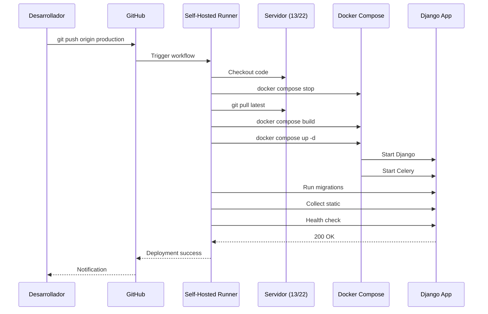

# Capítulo 3: Servidor de Aplicación

**Parte II: Infraestructura y Deployment**  
**Documento:** SGM Contabilidad - Documentación Completa v2.0  
**Fecha:** 28 de Noviembre de 2025  

---

## 3.1 Especificaciones de Hardware

### Servidor Producción: vm-bdo-outcontab1 (172.17.11.13)

**Hardware:**
```yaml
Nombre: vm-bdo-outcontab1
IP: 172.17.11.13
Tipo: Máquina Virtual (VMware vSphere)

Recursos:
  CPU: 4 cores (Intel Xeon)
  RAM: 8 GB DDR4
  Disco: 100 GB SSD
  Red: Gigabit Ethernet (1000 Mbps)

Capacidad de Crecimiento:
  CPU: Escalable hasta 8 cores
  RAM: Escalable hasta 16 GB
  Disco: Expandible hasta 500 GB
```

**Uso Actual de Recursos:**
```yaml
CPU:
  Uso promedio: 25-35%
  Picos: 60-70% (durante procesamiento masivo)
  Núcleos más usados: 2-3 de 4

RAM:
  Uso base: 2.5 GB (31%)
  Django + Gunicorn: 800 MB
  Celery workers (10): 1.2 GB (120 MB c/u)
  Redis: 400 MB
  Sistema operativo: 500 MB
  Disponible: 4.5 GB (56%)

Disco:
  Usado: 28 GB (28%)
  /: 15 GB (sistema y aplicaciones)
  /media: 8 GB (archivos temporales y resultados)
  /var/log: 3 GB (logs)
  /home: 2 GB (backups locales)
  Disponible: 72 GB

Red:
  Tráfico promedio: 50-100 Mbps
  Picos: 300-400 Mbps (uploads/downloads masivos)
  Conexiones concurrentes: 20-40
```

### Servidor Desarrollo: vm-bdo-q (172.17.11.22)

**Hardware:**
```yaml
Nombre: vm-bdo-q
IP: 172.17.11.22
Tipo: Máquina Virtual (VMware vSphere)

Recursos:
  CPU: 2 cores (Intel Xeon)
  RAM: 4 GB DDR4
  Disco: 50 GB SSD
  Red: Gigabit Ethernet (1000 Mbps)

Capacidad de Crecimiento:
  CPU: Escalable hasta 4 cores
  RAM: Escalable hasta 8 GB
  Disco: Expandible hasta 200 GB
```

**Uso Actual de Recursos:**
```yaml
CPU:
  Uso promedio: 15-25%
  Picos: 40-50%
  
RAM:
  Uso base: 1.8 GB (45%)
  Django: 500 MB
  Celery workers (5): 600 MB
  Redis: 200 MB
  Sistema: 500 MB
  Disponible: 2.2 GB (55%)

Disco:
  Usado: 18 GB (36%)
  Disponible: 32 GB
```

### Comparativa Producción vs Desarrollo

| Recurso | Producción | Desarrollo | Ratio |
|---------|------------|------------|-------|
| **CPU** | 4 cores | 2 cores | 2:1 |
| **RAM** | 8 GB | 4 GB | 2:1 |
| **Disco** | 100 GB | 50 GB | 2:1 |
| **Celery Workers** | 10 | 5 | 2:1 |
| **Gunicorn Workers** | 3 | 2 | 1.5:1 |
| **Usuarios Concurrentes** | 50+ | 10-15 | ~3:1 |
| **DEBUG Mode** | False | True | - |

---

## 3.2 Sistema Operativo y Configuración Base

### Sistema Operativo

**Ubuntu Server 22.04 LTS (Jammy Jellyfish)**
```bash
$ lsb_release -a
Distributor ID: Ubuntu
Description:    Ubuntu 22.04.5 LTS
Release:        22.04
Codename:       jammy

$ uname -a
Linux vm-bdo-outcontab1 5.15.0-119-generic #129-Ubuntu SMP x86_64 GNU/Linux
```

**Justificación de Elección:**
- ✅ LTS (Long Term Support): Soporte hasta abril 2027
- ✅ Estabilidad probada en entornos empresariales
- ✅ Amplio soporte de paquetes Python/Django
- ✅ Actualizaciones de seguridad regulares
- ✅ Compatibilidad con Docker y herramientas modernas

### Paquetes del Sistema Instalados

**Esenciales:**
```bash
# Build tools y dependencias
build-essential          # GCC, Make, etc.
python3.10               # Python runtime
python3.10-dev           # Headers de Python
python3-pip              # Gestor de paquetes Python
python3-venv             # Entornos virtuales

# Bases de datos
postgresql-client-14     # Cliente PostgreSQL
libpq-dev               # Librería PostgreSQL dev

# Redis
redis-tools             # Cliente Redis

# Utilidades
git                     # Control de versiones
curl                    # HTTP client
wget                    # Descarga de archivos
vim                     # Editor de texto
htop                    # Monitor de procesos
ncdu                    # Análisis de disco
net-tools               # Herramientas de red
```

**Docker y Contenedores:**
```bash
docker-ce               # Docker Engine 24.0.7
docker-ce-cli           # Docker CLI
docker-compose-plugin   # Docker Compose v2
containerd.io           # Container runtime
```

**Seguridad y Monitoreo:**
```bash
ufw                     # Firewall
fail2ban                # Protección contra brute force
logrotate               # Rotación de logs
cron                    # Tareas programadas
```

### Configuración de Red

**Interfaces de Red:**
```bash
# /etc/netplan/00-installer-config.yaml
network:
  version: 2
  ethernets:
    ens160:
      addresses:
        - 172.17.11.13/24    # Producción
        # - 172.17.11.22/24  # Desarrollo
      gateway4: 172.17.11.1
      nameservers:
        addresses:
          - 172.17.11.10      # DNS corporativo BDO
          - 8.8.8.8           # DNS Google (backup)
```

**Hostname:**
```bash
# Producción
$ hostname
vm-bdo-outcontab1

# Desarrollo
$ hostname
vm-bdo-q

# /etc/hosts
127.0.0.1       localhost
172.17.11.13    vm-bdo-outcontab1
172.17.11.22    vm-bdo-q
172.17.11.21    vmbdobases
172.17.11.14    vm-bdo-outcontab2
```

### Usuarios y Permisos

**Usuarios del Sistema:**
```bash
# Usuario principal
outcontab1     # Producción (sudo)
outcontab2     # Desarrollo (sudo)

# Usuario de aplicación
sgm_user       # Usuario no-privilegiado para correr servicios

# Grupos
docker         # Acceso a Docker daemon
sudo           # Privilegios administrativos
```

**Configuración de Sudoers:**
```bash
# /etc/sudoers.d/outcontab
outcontab1 ALL=(ALL) NOPASSWD: /usr/bin/systemctl restart sgm-*
outcontab1 ALL=(ALL) NOPASSWD: /usr/bin/systemctl status sgm-*
outcontab1 ALL=(ALL) NOPASSWD: /usr/bin/docker compose *
```

### Firewall UFW

**Reglas Activas:**
```bash
# Estado del firewall
$ sudo ufw status verbose
Status: active
Logging: on (low)
Default: deny (incoming), allow (outgoing), disabled (routed)

# Reglas configuradas
To                         Action      From
--                         ------      ----
22/tcp                     ALLOW       172.17.11.0/24     # SSH
8000/tcp                   ALLOW       172.17.11.0/24     # Django API
5555/tcp                   ALLOW       172.17.11.0/24     # Flower
6379                       DENY        Anywhere            # Redis solo local
```

**Configuración:**
```bash
# Permitir SSH desde red interna
sudo ufw allow from 172.17.11.0/24 to any port 22 proto tcp

# Permitir Django API
sudo ufw allow from 172.17.11.0/24 to any port 8000 proto tcp

# Permitir Flower (monitoreo Celery)
sudo ufw allow from 172.17.11.0/24 to any port 5555 proto tcp

# Denegar acceso externo a Redis
sudo ufw deny 6379

# Activar firewall
sudo ufw enable
```

### Configuración del Sistema

**Límites de Recursos:**
```bash
# /etc/security/limits.conf
* soft nofile 65536
* hard nofile 65536
sgm_user soft nofile 32768
sgm_user hard nofile 32768
```

**Parámetros del Kernel:**
```bash
# /etc/sysctl.conf
# Network tuning
net.core.somaxconn = 1024
net.ipv4.tcp_max_syn_backlog = 2048
net.ipv4.ip_local_port_range = 10000 65000

# File descriptors
fs.file-max = 100000

# Memoria compartida (para PostgreSQL client)
kernel.shmmax = 268435456
kernel.shmall = 2097152

# Aplicar cambios
$ sudo sysctl -p
```

### Zona Horaria y Localización

```bash
# Zona horaria Chile
$ timedatectl
               Local time: Thu 2025-11-28 14:30:00 -03
           Universal time: Thu 2025-11-28 17:30:00 UTC
                 RTC time: Thu 2025-11-28 17:30:00
                Time zone: America/Santiago (-03, -0300)

# Localización
$ locale
LANG=en_US.UTF-8
LC_ALL=en_US.UTF-8
```

---

## 3.3 Stack de Aplicación (Django + React)

### Arquitectura de Deployment

```
┌──────────────────────────────────────────────┐
│         NGINX (Futuro - Opcional)            │
│         Proxy Reverso + Load Balancer        │
└────────────────┬─────────────────────────────┘
                 │
┌────────────────▼─────────────────────────────┐
│            GUNICORN (WSGI Server)            │
│            3 workers (producción)            │
│            Puerto: 8000                      │
└────────────────┬─────────────────────────────┘
                 │
┌────────────────▼─────────────────────────────┐
│          DJANGO 5.2.8 APPLICATION            │
│                                              │
│  ┌──────────────┐  ┌───────────────────┐    │
│  │   API App    │  │  RindeGastos App  │    │
│  │  (REST DRF)  │  │  (Processing)     │    │
│  └──────────────┘  └───────────────────┘    │
│                                              │
│  ┌──────────────────────────────────────┐   │
│  │    Django Middleware Stack           │   │
│  │  • CORS                              │   │
│  │  • JWT Authentication                │   │
│  │  • Security                          │   │
│  └──────────────────────────────────────┘   │
└──────────────┬───────────────────────────────┘
               │
        ┌──────┴───────┐
        │              │
┌───────▼─────┐  ┌────▼──────────┐
│ PostgreSQL  │  │     Redis     │
│  (Remote)   │  │   (Local)     │
└─────────────┘  └───────────────┘
```

### Django Configuration

**Archivo: backend/sgm_backend/settings.py**

```python
import os
from pathlib import Path
from datetime import timedelta

# Build paths
BASE_DIR = Path(__file__).resolve().parent.parent

# SECURITY WARNING: keep the secret key used in production secret!
SECRET_KEY = os.environ.get('SECRET_KEY')

# SECURITY WARNING: don't run with debug turned on in production!
DEBUG = os.environ.get('DEBUG', 'False') == 'True'

ALLOWED_HOSTS = [
    'localhost',
    '127.0.0.1',
    '172.17.11.13',  # Producción
    '172.17.11.22',  # Desarrollo
]

# Application definition
INSTALLED_APPS = [
    # Django apps
    'django.contrib.admin',
    'django.contrib.auth',
    'django.contrib.contenttypes',
    'django.contrib.sessions',
    'django.contrib.messages',
    'django.contrib.staticfiles',
    
    # Third party apps
    'rest_framework',
    'rest_framework_simplejwt',
    'corsheaders',
    'django_celery_results',
    'django_redis',
    
    # Local apps
    'api',
    'rindegastos',
]

MIDDLEWARE = [
    'corsheaders.middleware.CorsMiddleware',
    'django.middleware.security.SecurityMiddleware',
    'whitenoise.middleware.WhiteNoiseMiddleware',
    'django.contrib.sessions.middleware.SessionMiddleware',
    'django.middleware.common.CommonMiddleware',
    'django.middleware.csrf.CsrfViewMiddleware',
    'django.contrib.auth.middleware.AuthenticationMiddleware',
    'django.contrib.messages.middleware.MessageMiddleware',
    'django.middleware.clickjacking.XFrameOptionsMiddleware',
]

# Database
DATABASES = {
    'default': {
        'ENGINE': 'django.db.backends.postgresql',
        'NAME': os.environ.get('POSTGRES_DB', 'sgm_db_dev'),
        'USER': os.environ.get('POSTGRES_USER', 'sgm_user'),
        'PASSWORD': os.environ.get('POSTGRES_PASSWORD'),
        'HOST': os.environ.get('POSTGRES_HOST', '172.17.11.21'),
        'PORT': os.environ.get('POSTGRES_PORT', '5432'),
        'CONN_MAX_AGE': 600,  # Connection pooling
        'OPTIONS': {
            'connect_timeout': 10,
        }
    }
}

# Redis Cache
CACHES = {
    'default': {
        'BACKEND': 'django_redis.cache.RedisCache',
        'LOCATION': f"redis://:{os.environ.get('REDIS_PASSWORD')}@redis:6379/0",
        'OPTIONS': {
            'CLIENT_CLASS': 'django_redis.client.DefaultClient',
            'SOCKET_CONNECT_TIMEOUT': 5,
            'SOCKET_TIMEOUT': 5,
            'RETRY_ON_TIMEOUT': True,
            'MAX_CONNECTIONS': 50,
        },
        'KEY_PREFIX': 'sgm',
        'TIMEOUT': 300,  # 5 minutos default
    }
}

# Celery Configuration
CELERY_BROKER_URL = f"redis://:{os.environ.get('REDIS_PASSWORD')}@redis:6379/0"
CELERY_RESULT_BACKEND = 'django-db'
CELERY_ACCEPT_CONTENT = ['json']
CELERY_TASK_SERIALIZER = 'json'
CELERY_RESULT_SERIALIZER = 'json'
CELERY_TIMEZONE = 'America/Santiago'
CELERY_TASK_TRACK_STARTED = True
CELERY_TASK_TIME_LIMIT = 3600  # 1 hora
CELERY_TASK_SOFT_TIME_LIMIT = 3000  # 50 minutos
CELERY_WORKER_PREFETCH_MULTIPLIER = 1
CELERY_WORKER_MAX_TASKS_PER_CHILD = 100

# REST Framework
REST_FRAMEWORK = {
    'DEFAULT_AUTHENTICATION_CLASSES': [
        'rest_framework_simplejwt.authentication.JWTAuthentication',
    ],
    'DEFAULT_PERMISSION_CLASSES': [
        'rest_framework.permissions.IsAuthenticated',
    ],
    'DEFAULT_PAGINATION_CLASS': 'rest_framework.pagination.PageNumberPagination',
    'PAGE_SIZE': 20,
    'DEFAULT_FILTER_BACKENDS': [
        'django_filters.rest_framework.DjangoFilterBackend',
    ],
}

# JWT Settings
SIMPLE_JWT = {
    'ACCESS_TOKEN_LIFETIME': timedelta(hours=8),
    'REFRESH_TOKEN_LIFETIME': timedelta(days=3),
    'ROTATE_REFRESH_TOKENS': True,
    'BLACKLIST_AFTER_ROTATION': True,
    'UPDATE_LAST_LOGIN': True,
    'ALGORITHM': 'HS256',
    'SIGNING_KEY': SECRET_KEY,
    'AUTH_HEADER_TYPES': ('Bearer',),
}

# CORS Settings
if DEBUG:
    CORS_ALLOWED_ORIGINS = [
        'http://localhost:5174',
        'http://172.17.11.13:5174',
        'http://172.17.11.22:5174',
        'http://172.17.11.13:8000',
        'http://172.17.11.22:8000',
    ]
else:
    CORS_ALLOWED_ORIGINS = [
        'http://172.17.11.13:8000',
        'http://172.17.11.22:8000',
    ]

CORS_ALLOW_CREDENTIALS = True

# Static files (CSS, JavaScript, Images)
STATIC_URL = '/static/'
STATIC_ROOT = BASE_DIR / 'staticfiles'
STATICFILES_STORAGE = 'whitenoise.storage.CompressedManifestStaticFilesStorage'

# Media files
MEDIA_URL = '/media/'
MEDIA_ROOT = BASE_DIR / 'media'

# File upload limits
DATA_UPLOAD_MAX_NUMBER_FIELDS = 200000
DATA_UPLOAD_MAX_MEMORY_SIZE = 5242880  # 5MB
FILE_UPLOAD_MAX_MEMORY_SIZE = 5242880  # 5MB

# Logging
LOGGING = {
    'version': 1,
    'disable_existing_loggers': False,
    'formatters': {
        'verbose': {
            'format': '{levelname} {asctime} {module} {message}',
            'style': '{',
        },
    },
    'handlers': {
        'file': {
            'level': 'INFO',
            'class': 'logging.handlers.RotatingFileHandler',
            'filename': BASE_DIR / 'logs' / 'django.log',
            'maxBytes': 10485760,  # 10MB
            'backupCount': 5,
            'formatter': 'verbose',
        },
        'console': {
            'level': 'DEBUG' if DEBUG else 'INFO',
            'class': 'logging.StreamHandler',
            'formatter': 'verbose',
        },
    },
    'loggers': {
        'django': {
            'handlers': ['file', 'console'],
            'level': 'INFO',
            'propagate': False,
        },
        'api': {
            'handlers': ['file', 'console'],
            'level': 'DEBUG' if DEBUG else 'INFO',
            'propagate': False,
        },
        'rindegastos': {
            'handlers': ['file', 'console'],
            'level': 'DEBUG' if DEBUG else 'INFO',
            'propagate': False,
        },
    },
}
```

### Gunicorn Configuration

**Archivo: backend/gunicorn.conf.py**

```python
import multiprocessing
import os

# Server socket
bind = "0.0.0.0:8000"
backlog = 2048

# Worker processes
workers = int(os.environ.get('GUNICORN_WORKERS', 3))
worker_class = "sync"
worker_connections = 1000
max_requests = 1000
max_requests_jitter = 50
timeout = 120
keepalive = 5

# Logging
accesslog = "/app/logs/gunicorn_access.log"
errorlog = "/app/logs/gunicorn_error.log"
loglevel = "info"
access_log_format = '%(h)s %(l)s %(u)s %(t)s "%(r)s" %(s)s %(b)s "%(f)s" "%(a)s" %(D)s'

# Process naming
proc_name = "sgm_gunicorn"

# Server mechanics
daemon = False
pidfile = None
umask = 0
user = None
group = None
tmp_upload_dir = None

# SSL (opcional, para futuro)
# keyfile = None
# certfile = None
```

### Celery Configuration

**Archivo: backend/sgm_backend/celery.py**

```python
import os
from celery import Celery
from celery.schedules import crontab

# Set default Django settings
os.environ.setdefault('DJANGO_SETTINGS_MODULE', 'sgm_backend.settings')

# Create Celery app
app = Celery('sgm_backend')

# Load config from Django settings
app.config_from_object('django.conf:settings', namespace='CELERY')

# Auto-discover tasks in all installed apps
app.autodiscover_tasks()

# Celery Beat Schedule (tareas periódicas)
app.conf.beat_schedule = {
    'limpiar-archivos-temporales': {
        'task': 'rindegastos.tasks.limpiar_archivos_antiguos',
        'schedule': crontab(hour=3, minute=0),  # Diario a las 3 AM
    },
    'actualizar-cache-catalogos': {
        'task': 'api.tasks.actualizar_cache',
        'schedule': crontab(hour='*/6'),  # Cada 6 horas
    },
}

# Task routes
app.conf.task_routes = {
    'rindegastos.tasks.*': {'queue': 'rindegastos_queue'},
    'api.tasks.*': {'queue': 'default'},
}

@app.task(bind=True)
def debug_task(self):
    print(f'Request: {self.request!r}')
```

### React Frontend Configuration

**Archivo: vite.config.js**

```javascript
import { defineConfig } from 'vite'
import react from '@vitejs/plugin-react'
import path from 'path'

export default defineConfig({
  plugins: [react()],
  
  server: {
    host: '0.0.0.0',
    port: 5174,
    proxy: {
      '/api': {
        target: process.env.VITE_API_URL || 'http://172.17.11.13:8000',
        changeOrigin: true,
        secure: false,
      },
      '/media': {
        target: process.env.VITE_API_URL || 'http://172.17.11.13:8000',
        changeOrigin: true,
      }
    }
  },
  
  build: {
    outDir: 'dist',
    sourcemap: false,
    rollupOptions: {
      output: {
        manualChunks: {
          'react-vendor': ['react', 'react-dom', 'react-router-dom'],
          'ui-vendor': ['@headlessui/react', 'framer-motion'],
          'utils': ['axios', 'date-fns'],
        }
      }
    },
    chunkSizeWarningLimit: 1000,
  },
  
  resolve: {
    alias: {
      '@': path.resolve(__dirname, './src'),
      '@components': path.resolve(__dirname, './src/components'),
      '@pages': path.resolve(__dirname, './src/pages'),
      '@api': path.resolve(__dirname, './src/api'),
      '@hooks': path.resolve(__dirname, './src/hooks'),
      '@utils': path.resolve(__dirname, './src/utils'),
    }
  },
  
  optimizeDeps: {
    include: ['react', 'react-dom', 'axios'],
  },
})
```

**Archivo: .env.production**

```bash
VITE_API_URL=http://172.17.11.13:8000
VITE_APP_NAME=SGM Contabilidad
VITE_APP_VERSION=2.0.0
```

---

## 3.4 Servicios Activos

### Vista General de Servicios

```bash
# Servicios en Producción (172.17.11.13)
$ docker compose ps

NAME                STATUS              PORTS
sgm-django-1        Up 14 days         0.0.0.0:8000->8000/tcp
sgm-celery-1        Up 14 days         
sgm-celery-beat-1   Up 14 days         
sgm-redis-1         Up 14 days         0.0.0.0:6379->6379/tcp
sgm-flower-1        Up 14 days         0.0.0.0:5555->5555/tcp
```

### Django API Service

**Estado:**
```bash
$ docker compose exec django python manage.py check --deploy
System check identified no issues (0 silenced).

$ docker compose logs django --tail=50
[2025-11-28 14:30:15 +0000] [1] [INFO] Starting gunicorn 23.0.0
[2025-11-28 14:30:15 +0000] [1] [INFO] Listening at: http://0.0.0.0:8000
[2025-11-28 14:30:15 +0000] [1] [INFO] Using worker: sync
[2025-11-28 14:30:15 +0000] [8] [INFO] Booting worker with pid: 8
[2025-11-28 14:30:15 +0000] [9] [INFO] Booting worker with pid: 9
[2025-11-28 14:30:15 +0000] [10] [INFO] Booting worker with pid: 10
```

**Health Check:**
```bash
$ curl http://localhost:8000/api/ping/
{"status": "ok", "timestamp": "2025-11-28T14:30:00Z"}

$ curl -I http://localhost:8000/api/clientes/
HTTP/1.1 401 Unauthorized
Content-Type: application/json
# Correcto: requiere autenticación
```

**Métricas:**
```yaml
Workers: 3 (Gunicorn)
Memoria por worker: ~250-300 MB
CPU por worker: 5-15%
Requests/segundo: ~10-20 (promedio)
Latencia promedio: 150-300ms
Uptime: 14 días 6 horas
```

### Celery Workers Service

**Estado:**
```bash
$ docker compose exec celery celery -A sgm_backend inspect active
-> celery@worker1: OK
    - empty -

$ docker compose exec celery celery -A sgm_backend inspect stats
-> celery@worker1: OK
    {
        "total": {
            "rindegastos.tasks.procesar_rinde_gastos": 1247,
            "api.tasks.actualizar_cache": 168
        },
        "pool": {
            "max-concurrency": 10,
            "processes": [12, 13, 14, 15, 16, 17, 18, 19, 20, 21],
            "max-tasks-per-child": 100,
            "timeouts": [3000, 3600]
        }
    }
```

**Workers Activos:**
```bash
# Producción: 10 workers
celery@worker1
├── Process 12 (MainProcess)
├── Process 13 (ForkPoolWorker-1)
├── Process 14 (ForkPoolWorker-2)
├── Process 15 (ForkPoolWorker-3)
├── Process 16 (ForkPoolWorker-4)
├── Process 17 (ForkPoolWorker-5)
├── Process 18 (ForkPoolWorker-6)
├── Process 19 (ForkPoolWorker-7)
├── Process 20 (ForkPoolWorker-8)
├── Process 21 (ForkPoolWorker-9)
└── Process 22 (ForkPoolWorker-10)

# Desarrollo: 5 workers
celery@worker1
├── Process 12 (MainProcess)
├── Process 13 (ForkPoolWorker-1)
├── Process 14 (ForkPoolWorker-2)
├── Process 15 (ForkPoolWorker-3)
├── Process 16 (ForkPoolWorker-4)
└── Process 17 (ForkPoolWorker-5)
```

**Métricas:**
```yaml
Workers concurrentes: 10 (prod) / 5 (dev)
Memoria por worker: ~100-150 MB
Tareas procesadas (24h): ~50-100
Tareas fallidas (24h): 0-2
Tiempo promedio por tarea: 3-8 minutos
Queue backlog: 0-5 tareas
```

### Redis Service

**Estado:**
```bash
$ docker compose exec redis redis-cli -a $REDIS_PASSWORD INFO
# Server
redis_version:7.2.5
redis_mode:standalone
os:Linux 5.15.0-119-generic x86_64
uptime_in_seconds:1209600
uptime_in_days:14

# Clients
connected_clients:15
blocked_clients:0

# Memory
used_memory:419430400
used_memory_human:400M
used_memory_peak:524288000
used_memory_peak_human:500M

# Stats
total_connections_received:2847
total_commands_processed:187942
instantaneous_ops_per_sec:15

# Keyspace
db0:keys=1247,expires=847,avg_ttl=12847382
```

**Uso de Redis:**
```yaml
Funciones:
  - Broker de Celery (cola de tareas)
  - Result backend (resultados de tareas)
  - Cache de Django (queries, sesiones)
  - Cache de datos temporales

Memoria usada: 400 MB de 2 GB (20%)
Keys almacenadas: ~1,247
Keys con expiración: ~847
Hit rate: 85-90%
```

### Flower (Celery Monitoring)

**Acceso:**
```bash
URL: http://172.17.11.13:5555
Usuario: admin
Password: [configurado en .env]
```

**Dashboard Features:**
- ✅ Vista en tiempo real de workers
- ✅ Tareas activas, programadas y completadas
- ✅ Gráficos de rendimiento
- ✅ Logs de tareas
- ✅ Retry de tareas fallidas
- ✅ Revoke de tareas en proceso

**Métricas Visibles:**
```yaml
Tasks:
  - Total ejecutadas: 1,247
  - Exitosas: 1,243 (99.7%)
  - Fallidas: 4 (0.3%)
  - Promedio: 3.5 tareas/hora

Workers:
  - Online: 10/10
  - Ocupados: 2
  - Disponibles: 8
  - Tareas en cola: 1
```

---

## 3.5 Configuración de Docker Compose

### Archivo docker-compose.yml

**Ubicación:** `/home/outcontab1/sgm-contabilidad/docker-compose.yml`

```yaml
version: '3.8'

services:
  # Django API + Gunicorn
  django:
    build:
      context: ./backend
      dockerfile: Dockerfile
    container_name: sgm-django
    command: >
      sh -c "python manage.py collectstatic --noinput &&
             python manage.py migrate --noinput &&
             gunicorn sgm_backend.wsgi:application 
             --config gunicorn.conf.py"
    volumes:
      - ./backend:/app
      - static_volume:/app/staticfiles
      - media_volume:/app/media
      - logs_volume:/app/logs
    ports:
      - "8000:8000"
    env_file:
      - .env
    environment:
      - DJANGO_SETTINGS_MODULE=sgm_backend.settings
      - POSTGRES_HOST=172.17.11.21
      - PYTHONUNBUFFERED=1
    depends_on:
      - redis
    networks:
      - sgm_network
    restart: unless-stopped
    healthcheck:
      test: ["CMD", "curl", "-f", "http://localhost:8000/api/ping/"]
      interval: 30s
      timeout: 10s
      retries: 3
      start_period: 40s

  # Celery Worker
  celery:
    build:
      context: ./backend
      dockerfile: Dockerfile
    container_name: sgm-celery
    command: >
      celery -A sgm_backend worker 
      --loglevel=info 
      --concurrency=${CELERY_WORKERS:-10}
      --max-tasks-per-child=100
    volumes:
      - ./backend:/app
      - media_volume:/app/media
      - logs_volume:/app/logs
    env_file:
      - .env
    environment:
      - DJANGO_SETTINGS_MODULE=sgm_backend.settings
      - POSTGRES_HOST=172.17.11.21
      - C_FORCE_ROOT=true
    depends_on:
      - redis
      - django
    networks:
      - sgm_network
    restart: unless-stopped
    healthcheck:
      test: ["CMD", "celery", "-A", "sgm_backend", "inspect", "ping"]
      interval: 60s
      timeout: 30s
      retries: 3

  # Celery Beat (Tareas programadas)
  celery-beat:
    build:
      context: ./backend
      dockerfile: Dockerfile
    container_name: sgm-celery-beat
    command: celery -A sgm_backend beat --loglevel=info --scheduler django_celery_beat.schedulers:DatabaseScheduler
    volumes:
      - ./backend:/app
      - logs_volume:/app/logs
    env_file:
      - .env
    environment:
      - DJANGO_SETTINGS_MODULE=sgm_backend.settings
      - POSTGRES_HOST=172.17.11.21
    depends_on:
      - redis
      - django
    networks:
      - sgm_network
    restart: unless-stopped

  # Redis
  redis:
    image: redis:7.2-alpine
    container_name: sgm-redis
    command: >
      redis-server 
      --requirepass ${REDIS_PASSWORD}
      --maxmemory 2gb
      --maxmemory-policy allkeys-lru
      --save 60 1000
      --appendonly yes
    ports:
      - "6379:6379"
    volumes:
      - redis_data:/data
    networks:
      - sgm_network
    restart: unless-stopped
    healthcheck:
      test: ["CMD", "redis-cli", "-a", "${REDIS_PASSWORD}", "ping"]
      interval: 10s
      timeout: 3s
      retries: 5

  # Flower (Monitoreo Celery)
  flower:
    build:
      context: ./backend
      dockerfile: Dockerfile
    container_name: sgm-flower
    command: >
      celery -A sgm_backend flower 
      --port=5555
      --basic_auth=${FLOWER_USER}:${FLOWER_PASSWORD}
    ports:
      - "5555:5555"
    env_file:
      - .env
    environment:
      - DJANGO_SETTINGS_MODULE=sgm_backend.settings
      - POSTGRES_HOST=172.17.11.21
    depends_on:
      - redis
      - celery
    networks:
      - sgm_network
    restart: unless-stopped

volumes:
  static_volume:
    driver: local
  media_volume:
    driver: local
  redis_data:
    driver: local
  logs_volume:
    driver: local

networks:
  sgm_network:
    driver: bridge
```

### Dockerfile Backend

**Ubicación:** `/home/outcontab1/sgm-contabilidad/backend/Dockerfile`

```dockerfile
FROM python:3.10-slim

# Metadata
LABEL maintainer="BDO Chile <dev@bdo.cl>"
LABEL description="SGM Contabilidad Backend"

# Environment variables
ENV PYTHONUNBUFFERED=1 \
    PYTHONDONTWRITEBYTECODE=1 \
    PIP_NO_CACHE_DIR=1 \
    PIP_DISABLE_PIP_VERSION_CHECK=1

# System dependencies
RUN apt-get update && apt-get install -y \
    gcc \
    g++ \
    postgresql-client \
    libpq-dev \
    curl \
    && rm -rf /var/lib/apt/lists/*

# Working directory
WORKDIR /app

# Install Python dependencies
COPY requirements.txt .
RUN pip install --upgrade pip && \
    pip install -r requirements.txt

# Copy application code
COPY . .

# Create necessary directories
RUN mkdir -p /app/staticfiles /app/media /app/logs && \
    chmod -R 755 /app/media /app/logs

# Collect static files (se ejecuta en command del compose)
# RUN python manage.py collectstatic --noinput

# Expose port
EXPOSE 8000

# Default command (se sobrescribe en docker-compose)
CMD ["gunicorn", "sgm_backend.wsgi:application", "--bind", "0.0.0.0:8000"]
```

### Variables de Entorno (.env)

**Ubicación:** `/home/outcontab1/sgm-contabilidad/.env`

```bash
# Django
SECRET_KEY=django-insecure-CAMBIAR-EN-PRODUCCION-xyz123
DEBUG=False
ALLOWED_HOSTS=localhost,127.0.0.1,172.17.11.13,172.17.11.22

# PostgreSQL
POSTGRES_DB=sgm_db_dev
POSTGRES_USER=sgm_user
POSTGRES_PASSWORD=TU_PASSWORD_SEGURA_AQUI
POSTGRES_HOST=172.17.11.21
POSTGRES_PORT=5432

# Redis
REDIS_PASSWORD=TU_REDIS_PASSWORD_AQUI

# Celery
CELERY_WORKERS=10  # Producción: 10, Desarrollo: 5

# Flower
FLOWER_USER=admin
FLOWER_PASSWORD=TU_FLOWER_PASSWORD_AQUI

# Email (futuro)
# EMAIL_HOST=smtp.gmail.com
# EMAIL_PORT=587
# EMAIL_HOST_USER=
# EMAIL_HOST_PASSWORD=
# EMAIL_USE_TLS=True

# Sentry (opcional, para logging de errores)
# SENTRY_DSN=
```

**⚠️ Seguridad:**
- Este archivo NO debe commitearse a Git
- Incluido en `.gitignore`
- Permisos: `chmod 600 .env`
- Backup seguro fuera del repositorio

---

## 3.6 CI/CD con GitHub Actions

### Workflow de Deployment

**Archivo:** `.github/workflows/deploy-production.yml`

```yaml
name: Deploy to Production

on:
  push:
    branches:
      - production
  workflow_dispatch:

jobs:
  deploy:
    name: Deploy SGM to Production
    runs-on: self-hosted
    
    steps:
      - name: Checkout code
        uses: actions/checkout@v4
        with:
          fetch-depth: 0
      
      - name: Set up environment
        run: |
          echo "DEPLOYMENT_TIME=$(date +'%Y-%m-%d %H:%M:%S')" >> $GITHUB_ENV
          echo "COMMIT_SHA=$(git rev-parse --short HEAD)" >> $GITHUB_ENV
      
      - name: Stop services
        run: |
          cd /home/outcontab1/sgm-contabilidad
          docker compose stop django celery celery-beat flower
      
      - name: Pull latest code
        run: |
          cd /home/outcontab1/sgm-contabilidad
          git fetch origin production
          git reset --hard origin/production
      
      - name: Build and start services
        run: |
          cd /home/outcontab1/sgm-contabilidad
          docker compose build --no-cache django celery
          docker compose up -d
      
      - name: Run migrations
        run: |
          cd /home/outcontab1/sgm-contabilidad
          docker compose exec -T django python manage.py migrate --noinput
      
      - name: Collect static files
        run: |
          cd /home/outcontab1/sgm-contabilidad
          docker compose exec -T django python manage.py collectstatic --noinput
      
      - name: Health check
        run: |
          cd /home/outcontab1/sgm-contabilidad
          sleep 10
          curl -f http://localhost:8000/api/ping/ || exit 1
      
      - name: Clean up old images
        run: |
          docker image prune -af --filter "until=48h"
      
      - name: Notify deployment
        if: always()
        run: |
          echo "Deployment completed at: ${{ env.DEPLOYMENT_TIME }}"
          echo "Commit SHA: ${{ env.COMMIT_SHA }}"
          echo "Status: ${{ job.status }}"
```

**Archivo:** `.github/workflows/deploy-development.yml`

```yaml
name: Deploy to Development

on:
  push:
    branches:
      - development
  workflow_dispatch:

jobs:
  deploy:
    name: Deploy SGM to Development
    runs-on: self-hosted
    
    steps:
      # Similar a producción pero apuntando a 172.17.11.22
      - name: Checkout code
        uses: actions/checkout@v4
      
      - name: Deploy to development server
        run: |
          ssh outcontab2@172.17.11.22 "cd /home/outcontab2/sgm-contabilidad && \
            git fetch origin development && \
            git reset --hard origin/development && \
            docker compose down && \
            docker compose up -d --build"
```

### Self-Hosted Runners

**Configuración en Producción (172.17.11.13):**

```bash
# Directorio del runner
/home/outcontab1/actions-runner

# Servicio systemd
$ sudo cat /etc/systemd/system/actions.runner.BDO-Chile-SGM-Contabilidad.sgm-runner-prod.service

[Unit]
Description=GitHub Actions Runner (sgm-runner-prod)
After=network.target

[Service]
ExecStart=/home/outcontab1/actions-runner/run.sh
User=outcontab1
WorkingDirectory=/home/outcontab1/actions-runner
KillMode=process
KillSignal=SIGTERM
TimeoutStopSec=5min

[Install]
WantedBy=multi-user.target

# Estado del runner
$ sudo systemctl status actions.runner.BDO-Chile-SGM-Contabilidad.sgm-runner-prod
● actions.runner.BDO-Chile-SGM-Contabilidad.sgm-runner-prod.service
   Loaded: loaded
   Active: active (running) since Mon 2025-11-14 10:30:15 -03; 2 weeks ago
```

**Configuración en Desarrollo (172.17.11.22):**

Similar a producción pero con nombre `sgm-runner-dev`.

### Proceso de Deployment



### Rollback Procedure

**En caso de fallo en deployment:**

```bash
# 1. Detener servicios actuales
cd /home/outcontab1/sgm-contabilidad
docker compose down

# 2. Volver a commit anterior
git log --oneline -n 5  # Ver últimos commits
git reset --hard <commit-sha-anterior>

# 3. Rebuild y restart
docker compose build --no-cache
docker compose up -d

# 4. Verificar
curl http://localhost:8000/api/ping/
docker compose logs -f django
```

### Monitoreo de Deployments

```bash
# Ver últimos deployments
$ gh run list --workflow=deploy-production.yml --limit 10

STATUS    TITLE                   WORKFLOW            BRANCH      EVENT  ID
✓         Deploy to Production    Deploy Production   production  push   7891234567
✓         Deploy to Production    Deploy Production   production  push   7891234566
✗         Deploy to Production    Deploy Production   production  push   7891234565

# Ver logs de deployment específico
$ gh run view 7891234567 --log
```

---

## Resumen del Capítulo 3

✅ **Hardware:** 4 cores, 8GB RAM (prod) / 2 cores, 4GB RAM (dev)  
✅ **OS:** Ubuntu 22.04 LTS con Docker 24.0.7  
✅ **Stack:** Django 5.2 + Gunicorn (3 workers) + Celery (10 workers) + Redis  
✅ **Deployment:** Docker Compose con 5 servicios (django, celery, beat, redis, flower)  
✅ **CI/CD:** GitHub Actions con self-hosted runners automáticos  
✅ **Monitoreo:** Flower, logs, health checks  

---

**📖 Navegación:**
- ⬅️ [Capítulo 2: Arquitectura del Sistema](./02_arquitectura_del_sistema.md)
- 🏠 [Volver al Índice](../DOCUMENTACION_COMPLETA_SGM.md)
- ➡️ [Capítulo 4: Servidor de Base de Datos](./04_servidor_base_datos.md)

---

**Documento generado para BDO Chile - SGM Contabilidad**  
**Última actualización:** 28 de Noviembre 2025
