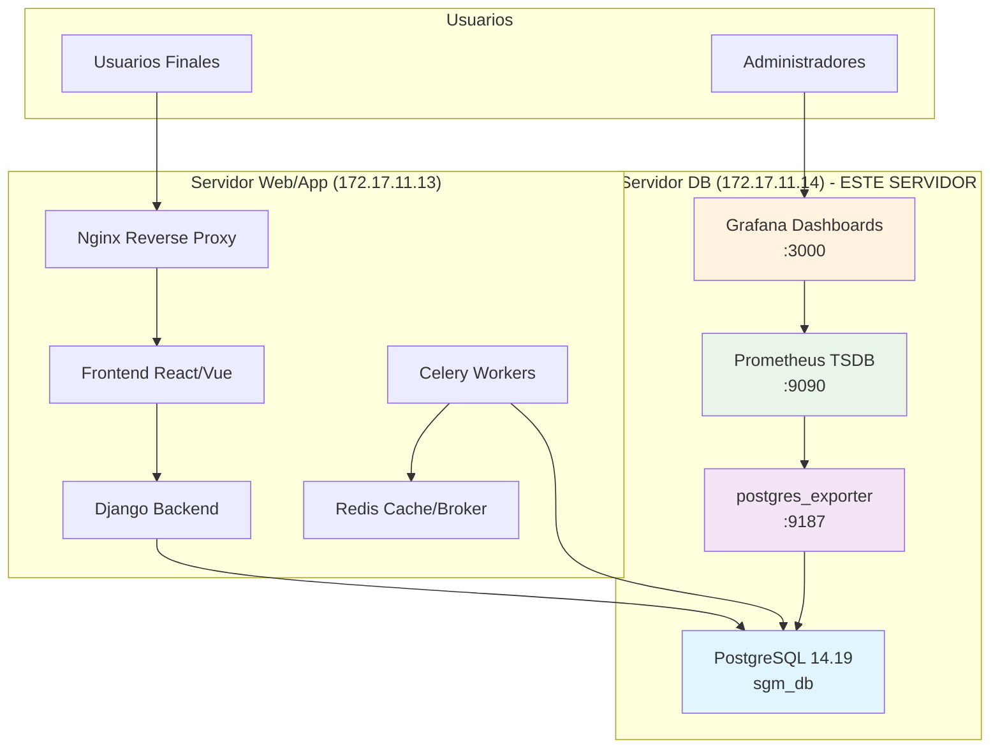

# 📚 Documentación del Sistema - Servidor de Base de Datos SGM

**Servidor:** vm-bdo-outcontab2 (172.17.11.14)  
**Fecha de Documentación:** 28 de Noviembre, 2025  
**Función:** Servidor de Base de Datos PostgreSQL + Stack de Monitoreo  
**Red:** 🔒 Protegido por VPN Corporativa (Acceso interno empresarial)  

---

## 🏗️ Diagrama de Arquitectura de la Aplicación

### Arquitectura General del Sistema SGM



### Arquitectura de Monitoreo Detallada

```
┌─────────────────────────────────────────────────────────┐
│                    GRAFANA                              │
│         (Visualización de Métricas)                     │
│         http://172.17.11.14:3000                        │
│                                                         │
│  • Dashboards interactivos                              │
│  • Alertas configurables                                │
│  • Análisis histórico                                   │
│  • Usuario: admin/admin (CAMBIAR)                       │
└────────────────┬────────────────────────────────────────┘
                 │ PromQL Queries
                 │ HTTP REST API
                 │
┌────────────────▼────────────────────────────────────────┐
│                  PROMETHEUS                             │
│       (Base de Datos de Series Temporales)              │
│         http://172.17.11.14:9090                        │
│                                                         │
│  • Almacena 30 días de métricas                         │
│  • Recolección cada 15 segundos                         │
│  • Motor de consultas PromQL                            │
│  • Retención configurable                               │
└────────────────┬────────────────────────────────────────┘
                 │ HTTP Scraping /metrics
                 │ Cada 15 segundos
                 │
┌────────────────▼────────────────────────────────────────┐
│            POSTGRES_EXPORTER                            │
│         (Exportador de Métricas)                        │
│         http://172.17.11.14:9187/metrics                │
│                                                         │
│  • ~150 métricas de PostgreSQL                          │
│  • Convierte SQL a formato Prometheus                   │
│  • 1 conexión permanente a DB                           │
│  • Consultas optimizadas a pg_stat_*                    │
└────────────────┬────────────────────────────────────────┘
                 │ SQL Queries
                 │ SELECT FROM pg_stat_*
                 │
┌────────────────▼────────────────────────────────────────┐
│                 POSTGRESQL 14.19                       │
│               sgm_db (172.17.11.14:5432)               │
│                                                         │
│  • Base de datos principal del SGM                      │
│  • Optimizado para 4GB RAM / 2 CPU                      │
│  • pg_stat_statements habilitado                        │
│  • Acceso restringido desde 172.17.11.13               │
└─────────────────────────────────────────────────────────┘
```

---

## 🔐 Flujo de Autenticación y Autorización

### Niveles de Autenticación en el Servidor

#### 1. **PostgreSQL Database Access**
```yaml
Método: MD5 Hash Authentication
Restricción IP: 172.17.11.13/32 únicamente
Usuario Principal: sgm_user
Base de Datos: sgm_db
Configuración: /etc/postgresql/14/main/pg_hba.conf

Flujo:
  Django/Celery (172.17.11.13) → PostgreSQL (172.17.11.14)
  1. Conexión TCP a puerto 5432
  2. Validación de IP origin (solo 172.17.11.13)
  3. Autenticación MD5 con usuario/password
  4. Acceso autorizado a sgm_db únicamente
```

#### 2. **Grafana Dashboard Access**
```yaml
Método: Local User Authentication
Puerto: 3000 (accesible solo desde VPN corporativa)
Usuario Default: admin
Password Default: admin (cambiar por buena práctica)

Flujo:
  Administrador → Grafana Web Interface
  1. Acceso HTTP a puerto 3000
  2. Login con credenciales locales
  3. Sesión HTTP con cookies
  4. Acceso a dashboards según permisos
```

#### 3. **Prometheus API Access**
```yaml
Método: Sin autenticación (aceptable en VPN corporativa)
Puerto: 9090 (accesible solo desde VPN empresarial)
Tipo: Read-only API

Seguridad:
  - No contiene datos sensibles del negocio
  - Solo métricas técnicas (CPU, memoria, conexiones)
  - Recomendación: Restringir via VPN/Firewall
```

#### 4. **postgres_exporter Metrics**
```yaml
Método: Sin autenticación (endpoint interno)
Puerto: 9187 (solo para Prometheus)
Tipo: HTTP metrics endpoint

Seguridad:
  - Acceso técnico únicamente
  - No expone datos de aplicación
  - Solo estadísticas de base de datos
```

### Configuración de Seguridad de Red

```bash
# Reglas de Firewall (UFW)
Puerto 5432: RESTRINGIDO a 172.17.11.13/32
Puerto 3000: ABIERTO (Grafana - requiere login)
Puerto 9090: ABIERTO (Prometheus - sin datos sensibles)
Puerto 9187: INTERNO (postgres_exporter)

# pg_hba.conf Configuration
host    sgm_db    sgm_user    172.17.11.13/32    md5
local   all       postgres                       peer
```

---

## 💻 Inventario de Tecnologías Utilizadas

### **Sistema Operativo**
- **OS:** Ubuntu 22.04.5 LTS (Jammy Jellyfish)
- **Kernel:** Linux x86_64
- **Arquitectura:** 64-bit

### **Base de Datos**
- **PostgreSQL:** 14.19 (Ubuntu 14.19-0ubuntu0.22.04.1)
- **Encoding:** UTF-8
- **Extensiones:**
  - `pg_stat_statements` (estadísticas de queries)
  - Standard PostgreSQL extensions

### **Monitoreo y Observabilidad**
- **Prometheus:** Time Series Database
  - Versión: Latest stable
  - Puerto: 9090
  - Retención: 30 días
  - Storage: Local TSDB

- **Grafana:** Visualization Platform
  - Puerto: 3000
  - Dashboards: PostgreSQL monitoring
  - Data Source: Prometheus

- **postgres_exporter:** Metrics Exporter
  - Puerto: 9187
  - Métricas: ~150 PostgreSQL metrics
  - Formato: Prometheus metrics format

### **Herramientas del Sistema**
- **systemd:** Service Management
- **UFW:** Uncomplicated Firewall
- **cron:** Task Scheduling
- **logrotate:** Log Management

### **Bibliotecas y Dependencias**
```bash
# Paquetes Principales
postgresql-14
postgresql-client-14
postgresql-contrib-14

# Herramientas de Monitoreo
prometheus
grafana-server
postgres_exporter

# Herramientas del Sistema
curl
wget
net-tools
htop
```

### **Archivos de Configuración Principales**
```
/etc/postgresql/14/main/postgresql.conf
/etc/postgresql/14/main/pg_hba.conf
/etc/prometheus/prometheus.yml
/etc/grafana/grafana.ini
/etc/systemd/system/postgres_exporter.service
```

---

## ⚠️ APIs Expuestas

### **1. PostgreSQL Database API**
```yaml
Protocolo: PostgreSQL Wire Protocol
Puerto: 5432
Restricción: Solo desde 172.17.11.13
Autenticación: MD5 Hash

Endpoints de Conexión:
  - Host: 172.17.11.14
  - Puerto: 5432
  - Database: sgm_db
  - Usuario: sgm_user

Operaciones Permitidas:
  - SELECT, INSERT, UPDATE, DELETE
  - CREATE/DROP TABLE (con permisos)
  - Transacciones ACID
  - Prepared Statements
  - Connection Pooling
```

### **2. Prometheus Metrics API**
```yaml
Protocolo: HTTP REST API
Puerto: 9090
Acceso: Público (sin autenticación)
Formato: JSON/PromQL

Principales Endpoints:
  GET /api/v1/query
    - Parámetros: query (PromQL), time (timestamp)
    - Respuesta: JSON con datos de métrica
    - Ejemplo: ?query=pg_stat_activity_count{datname="sgm_db"}

  GET /api/v1/query_range
    - Parámetros: query, start, end, step
    - Respuesta: Series temporales en rango
    - Ejemplo: Datos de últimas 6 horas

  GET /api/v1/targets
    - Lista objetivos de scraping
    - Estado de postgres_exporter

  GET /api/v1/metadata
    - Metadatos de métricas disponibles
```

### **3. postgres_exporter Metrics Endpoint**
```yaml
Protocolo: HTTP
Puerto: 9187
Path: /metrics
Acceso: Interno (para Prometheus)
Formato: Prometheus Text Format

Métricas Principales:
  # Conexiones activas
  pg_stat_activity_count{datname="sgm_db",state="active"} 3
  
  # Transacciones
  pg_stat_database_xact_commit{datname="sgm_db"} 1247
  pg_stat_database_xact_rollback{datname="sgm_db"} 3
  
  # Configuración
  pg_settings_max_connections 100
  pg_settings_shared_buffers_bytes 1073741824
  
  # Performance
  pg_stat_database_blks_hit{datname="sgm_db"} 98234
  pg_stat_database_blks_read{datname="sgm_db"} 1876
```

### **4. Grafana Dashboard API**
```yaml
Protocolo: HTTP REST API
Puerto: 3000
Autenticación: Session-based (login requerido)
Formato: JSON

Principales Endpoints:
  POST /login
    - Autenticación de usuario
    - Credenciales: admin/admin (default)

  GET /api/search
    - Lista dashboards disponibles
    - Filtros por tag, folder

  GET /api/dashboards/db/{dashboard-slug}
    - Obtener configuración de dashboard

  POST /api/dashboards/db
    - Crear/actualizar dashboard
    - Requiere permisos de editor
```

---

## 🔒 Configuración de Seguridad

### **1. Seguridad de PostgreSQL**

#### Configuración de Acceso (pg_hba.conf)
```bash
# Ubicación: /etc/postgresql/14/main/pg_hba.conf

# Solo desde servidor de aplicación
host    sgm_db    sgm_user    172.17.11.13/32    md5

# Acceso local para administración
local   all       postgres                       peer
local   all       all                            md5

# Rechazar todo lo demás
host    all       all         0.0.0.0/0          reject
```

#### Configuración de Red (postgresql.conf)
```bash
# Ubicación: /etc/postgresql/14/main/postgresql.conf

# Escuchar solo en interfaces específicas
listen_addresses = 'localhost,172.17.11.14'

# Puerto estándar
port = 5432

# SSL deshabilitado (red interna confiable)
ssl = off

# Logging de conexiones (seguridad)
log_connections = on
log_disconnections = on
log_hostname = off
```

#### Configuración de Performance y Seguridad
```bash
# Límites de conexión
max_connections = 100
superuser_reserved_connections = 3

# Memoria optimizada para 4GB RAM
shared_buffers = 1GB
effective_cache_size = 2GB
work_mem = 16MB
maintenance_work_mem = 256MB

# Logging para auditoría
log_statement = 'mod'  # Log modificaciones
log_min_duration_statement = 1000  # Log queries >1s
```

### **2. Seguridad de Red y Firewall**

#### Configuración UFW (Uncomplicated Firewall)
```bash
# Estado actual: Inactivo (solo reglas definidas)
# Para activar: sudo ufw enable

# Reglas definidas:
ufw allow from 172.17.11.13 to any port 5432 proto tcp
ufw allow 3000/tcp  # Grafana (considerar restringir)
ufw allow 9090/tcp  # Prometheus (considerar restringir)
ufw allow 22/tcp    # SSH administrative access

# Regla implícita: deny all other incoming
```

#### Configuración de Red del Sistema
```bash
# /etc/sysctl.conf - Optimizaciones de seguridad aplicadas
vm.swappiness = 10          # Evitar swap excesivo
net.core.somaxconn = 1024   # Queue de conexiones
```

### **3. Seguridad de Servicios de Monitoreo**

#### Grafana Security
```yaml
# /etc/grafana/grafana.ini
[security]
admin_user = admin
admin_password = admin  # ⚠️ DEBE CAMBIARSE
disable_gravatar = true
cookie_secure = false  # HTTP local
strict_transport_security = false

[auth.anonymous]
enabled = false  # Requiere login

[users]
allow_sign_up = false  # Solo admin puede crear usuarios
```

#### Prometheus Security
```yaml
# /etc/prometheus/prometheus.yml
global:
  scrape_interval: 15s
  evaluation_interval: 15s

# Sin autenticación (métricas técnicas solamente)
# Recomendación: Implementar reverse proxy con auth
```

### **4. Gestión de Credenciales**

#### Variables de Entorno Seguras
```bash
# Para aplicación Django (en servidor 172.17.11.13)
POSTGRES_HOST=172.17.11.14
POSTGRES_PORT=5432
POSTGRES_DB=sgm_db
POSTGRES_USER=sgm_user
POSTGRES_PASSWORD=t2LShvMEC5nnbiCSQtzJtSyGiqt3HysI

# Fortaleza de contraseña:
# - 32 caracteres
# - Caracteres alfanuméricos + símbolos
# - Generada aleatoriamente
```

#### Ubicación de Archivos Sensibles
```bash
# Archivos con información sensible:
/home/outcontab2/postgresql_sgm_connection_info.txt
/home/outcontab2/CONFIGURACION_COMPLETA_PostgreSQL_Monitoreo.txt

# Permisos: Solo lectura para owner
chmod 600 /home/outcontab2/*connection_info.txt
```

### **5. Headers HTTP de Seguridad**

#### Grafana HTTP Headers
```yaml
# Configuraciones de seguridad HTTP en Grafana
[server]
protocol = http
http_port = 3000
domain = 172.17.11.14

# Headers implementados:
# X-Frame-Options: DENY
# X-Content-Type-Options: nosniff
# X-XSS-Protection: 1; mode=block
```

### **6. Políticas de CORS**
```yaml
# Grafana CORS (si es necesario para integración)
[security]
allow_embedding = false
cookie_samesite = strict

# Prometheus: No requiere CORS (API backend)
# PostgreSQL: No aplica (protocolo binario)
```

### **7. Cifrado de Datos**

#### En Reposo
```bash
# PostgreSQL data encryption:
# - Filesystem level: No implementado (red interna)
# - Application level: Depende de Django

# Ubicación de datos:
/var/lib/postgresql/14/main/  # Datos PostgreSQL
/var/lib/prometheus/          # Métricas Prometheus
/var/lib/grafana/            # Configuraciones Grafana
```

#### En Tránsito
```bash
# PostgreSQL: Sin SSL (red interna confiable)
# HTTP Services: Sin HTTPS (red interna)
# Recomendación: Implementar VPN para acceso externo
```

### **8. Validaciones del Lado del Servidor**

#### PostgreSQL Constraints
```sql
-- Implementadas en nivel de aplicación (Django ORM)
-- Constraints de base de datos según modelo de datos SGM
-- Foreign keys, unique constraints, check constraints
```

#### Input Validation
```bash
# postgres_exporter: Sanitiza queries automáticamente
# Grafana: Valida input en formularios web
# Prometheus: Valida sintaxis PromQL
```

---

## 📊 Métricas y Monitoreo

### **Métricas Clave Monitoreadas**
```yaml
Base de Datos:
  - Conexiones activas vs máximas
  - Transacciones por segundo (TPS)
  - Cache hit ratio (debe ser >90%)
  - Queries lentas (>1 segundo)
  - Tamaño de base de datos
  - Locks y deadlocks

Sistema:
  - Uso de CPU y memoria
  - Espacio en disco
  - I/O de red y disco
  - Uptime de servicios

Aplicación:
  - Conexiones por usuario/aplicación
  - Patrones de uso temporal
  - Errores de conexión
```

### **Dashboards Disponibles**
- **ID 9628:** PostgreSQL Database (principal)
- **ID 455:** PostgreSQL Overview
- **ID 6742:** PostgreSQL Server Exporter
- **URL:** http://172.17.11.14:3000

---

## 🔧 Mantenimiento y Administración

### **Scripts de Administración**
```bash
# Monitoreo rápido
/usr/local/bin/pg_monitor.sh

# Servicios
systemctl status postgresql prometheus grafana-server postgres_exporter
systemctl restart [service]

# Logs
journalctl -u postgresql -f
journalctl -u prometheus -f
```

### **Backups y Recuperación**
```bash
# Backup PostgreSQL (configurar en cron)
sudo -u postgres pg_dump sgm_db > /backup/sgm_db_$(date +%Y%m%d).sql

# Configuraciones importantes para backup
/etc/postgresql/14/main/postgresql.conf
/etc/postgresql/14/main/pg_hba.conf
/etc/prometheus/prometheus.yml
/etc/grafana/grafana.ini
```

---

## 📋 Recursos del Sistema

### **Especificaciones Actuales**
- **RAM Total:** 3.8GB (1.5GB usada, 2.0GB disponible)
- **CPUs:** 2 cores
- **Almacenamiento:** 48GB (9.5GB usados, 22% uso)
- **Red:** Gigabit Ethernet

### **Distribución de Recursos**
```yaml
PostgreSQL:         ~1.2GB RAM
Prometheus:         ~283MB RAM  
Grafana:            ~107MB RAM
postgres_exporter:  ~7.7MB RAM
Sistema Operativo:  ~500MB RAM
Total Usado:        ~2.1GB RAM (55%)
Disponible:         ~1.7GB RAM
```

---

## 🚀 Estado de Servicios

### **Servicios Activos**
✅ **postgresql.service** - PostgreSQL RDBMS (enabled, active)  
✅ **prometheus.service** - Prometheus TSDB (enabled, active, running 2+ weeks)  
✅ **postgres_exporter.service** - PostgreSQL Exporter (enabled, active, running 2+ weeks)  
✅ **grafana-server.service** - Grafana Dashboards (enabled, active, running 2+ weeks)  

### **Puertos Activos**
- **5432** - PostgreSQL (IPv4/IPv6)
- **9090** - Prometheus (IPv6)
- **9187** - postgres_exporter (IPv6)
- **3000** - Grafana (IPv6)

---

## 📞 Contacto y Soporte

**Documentación Técnica Completa:**
- `/home/outcontab2/CONFIGURACION_COMPLETA_PostgreSQL_Monitoreo.txt`
- `/home/outcontab2/ARQUITECTURA_MONITOREO_EXPLICADA.md`
- `/home/outcontab2/DASHBOARDS_GRAFANA_POSTGRESQL.md`

**URLs de Acceso:**
- **Grafana:** http://172.17.11.14:3000 (admin/admin)
- **Prometheus:** http://172.17.11.14:9090

**Servidor:** vm-bdo-outcontab2 (172.17.11.14)  
**Documentación Generada:** 28 de Noviembre, 2025

---

*Esta documentación cubre específicamente el servidor de base de datos y monitoreo del sistema SGM. Para documentación del servidor de aplicación (Django/Celery/Redis), consultar la documentación del servidor 172.17.11.13.*